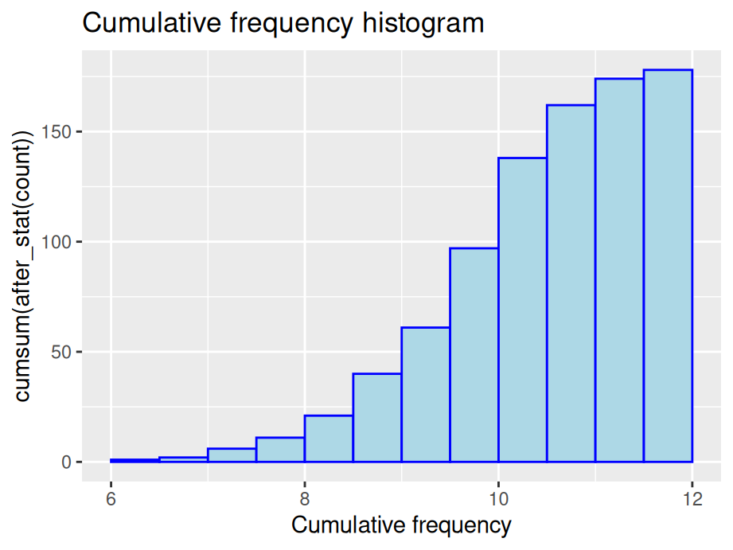
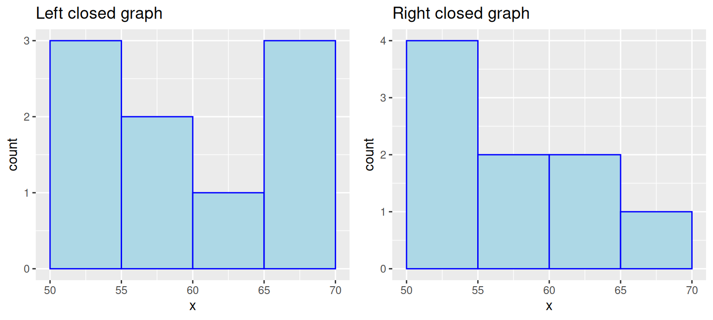
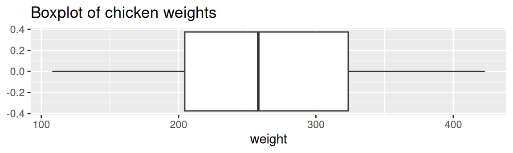
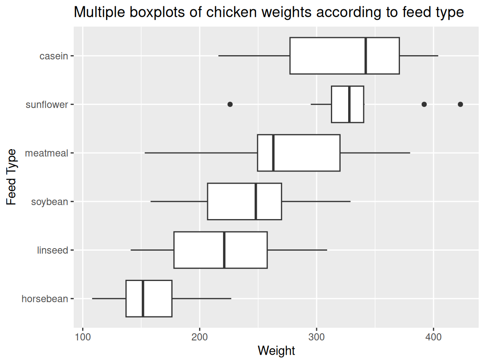
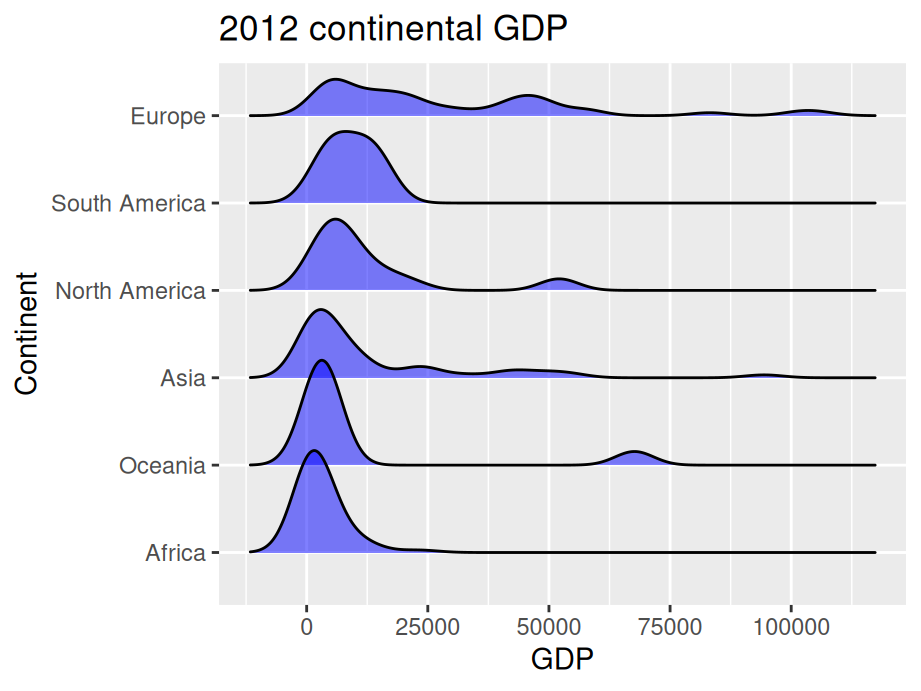

# Unidimensional continuous variables

In this chapter, we will demonstrate graphs with unidimensional continuous variables only using `ggplot2`.

## Histogram

### Basics and implications
We will start with an easy example.


```r
library(ggplot2)
library(gridExtra)

#Example data
x <- c(50, 51, 53, 55, 56, 60, 65, 65, 68)
#Stored as a dataframe
df <- data.frame(x)

ggplot(df, aes(x)) +
  ggtitle("Histogram of x with ggplot2") +
  geom_histogram(color = "blue", fill = "lightBlue", binwidth = 5, center = 52.5)
```


In this example, we used `geom_histogram` to create a histogram on variable `x`. We can see that it is quick to make and does not need much pre-processing. Moreover, Histograms show data’s empirical distribution within a set of intervals and we suggest using it as a one of the first steps to understand your data.

*Note:* as shown above, ggplot expects a dataframe, so make sure you do not throw a vector into ggplot.

### Types of histograms

The y-scale of histograms can be represented in a variety of ways to express different results:


1. Frequency or count: y = number of values that fall in each bin


```r
ggplot(finches, aes(x = Depth)) +
  geom_histogram(color="blue",fill="lightblue",binwidth = 0.5,boundary = 6) +
  ggtitle("Frequency histogram")
```


2. Cumulative frequency: y = total number of values <= (or <) right boundary of bin


```r
ggplot(finches, aes(x = Depth)) +
  geom_histogram(aes(y = cumsum(after_stat(count))), color="blue", fill="lightblue", binwidth = 0.5, boundary = 6) +
  ggtitle("Cumulative frequency histogram") +
  xlab("Cumulative frequency")
```



3. Density: y = relative frequency / binwidth


```r
ggplot(finches, aes(x = Depth)) +
  geom_histogram(aes(y = after_stat(density)), color = "blue", fill = "lightblue", binwidth = 0.5, boundary = 6) +
  ggtitle("Density histogram")
```


### Parameters for geom_histogram

#### Bin boundaries

Be mindful of the boundaries of the bins and whether a point will fall into the left or right bin if it is on a boundary. You can use the parameter `closed` to control the intervals.


```r
p1 <- ggplot(df, aes(x)) +
  geom_histogram(color = "blue", fill = "lightblue", 
                 binwidth = 5, center = 52.5, closed = "left")  +
  ggtitle("Left closed graph")

p2 <- ggplot(df, aes(x)) +
  geom_histogram(color = "blue", fill = "lightblue", 
                 binwidth = 5, center = 52.5, closed="right")  +
  ggtitle("Right closed graph")

grid.arrange(p1, p2, ncol = 2)
```




#### Bin numbers


```r
#Default / Only adding some styles to make graph consistent
ggplot(finches, aes(x = Depth)) +
  geom_histogram(color = "blue", fill = "lightblue") +
  ggtitle("Default with pop-up about bin number")
```


We start by passing no parameters into `geom_histogram` and you will notice a pop-up saying that the default number of bins is 30.
We see that the graph is not ideal with some gaps. There are two ways to modify the number of bins: specify the width explicitly with **binwidth** or provide the desired number of bins with **bins**. Consider the following modifications:


```r
# using binwidth
p3 <- ggplot(finches, aes(x = Depth)) +
  geom_histogram(color = "blue", fill = "lightblue", binwidth = 0.5, boundary = 6) +
  ggtitle("Changed binwidth value")

# using bins
p4 <- ggplot(finches, aes(x = Depth)) +
  geom_histogram(color="blue", fill = "lightblue", bins = 15, boundary = 6) +
  ggtitle("Changed bin value")

# format plot layout
grid.arrange(p3, p4, ncol = 2)
```


*Note:* There is no gold standard on the number of bins, so try different numbers to generate best results.

#### Bin alignment

Consider this comparison


```r
p5 <- ggplot(finches, aes(x = Depth)) +
  geom_histogram(color = "blue", fill = "lightblue", binwidth = 0.5) +
  ggtitle("Without alignment")

p6 <- ggplot(finches, aes(x = Depth)) +
  geom_histogram(color = "blue", fill = "lightblue", bins = 15, boundary = 6) +
  ggtitle("With alignment")

grid.arrange(p5, p6, ncol = 2)
```


Notice that the boundary of bins does not start at an axis and the only difference in the code is the removal of `boundry`. To control the position of bins, we can use either parameter `center` or `boundary`. You can use `boundary` to specify the endpoint of any bin or `center` to specify the center of any bin and ggplot2 will be able to calculate where to place the rest of the bins.  (Also, notice that when the boundary was changed, the number of bins got smaller by one. This is because by default the bins are centered and go over/under the range of the data.) In the above example, we specify `boundary` to be 6. We can see the first bin starts at 6 and the position of other bins are calculated based on the binwidth 0.5.

### Interactive histograms with `ggvis`

The `ggvis` package is not currently in development, but does certain things very well, such as adjusting parameters of a histogram interactively while coding. If you are interested, refer [here](https://ggvis.rstudio.com/ggvis-basics.html).

<br>

## Boxplots

### Single boxplot

A boxplot is one of the simplest ways of representing a distribution of a continuous variable (**Never** use boxplots for categorical data). It consists of two parts: box and whiskers. Let's starting with a simple example: single boxplot.


```r
ggplot(chickwts, aes(x = weight)) +
  geom_boxplot() +
  ggtitle("Boxplot of chicken weights")
```



Here as you can see, boxplots provide a ton of information for a single chart. Boxplots tell you whether the variable is normally distributed, or if the distribution is skewed in either direction. You can also easily spot the outliers, which always helps.

[Make a boxplot interactively](https://jtr13.github.io/D3/Boxplot.html) (*created with D3*)

### Multiple boxplots

Next, what if you want to compare the distributions between multiple classes? Here, you can create a multiple boxplot. But remember, your data frame needs to be tidy, that is you need to have a column with levels of the grouping variable. It can be be factor, character, or integer class.

The following example still use the ``chickwts`` dataset. We compare the distributions of ``weight`` between different ``feed``(which is a column with six factor levels).


```r
ggplot(chickwts, aes(x = reorder(feed, -weight, median),y = weight)) +
  geom_boxplot() +
  ggtitle("Multiple boxplots of chicken weights according to feed type") +
  labs(y = "Weight", x = "Feed Type")
```


**Note.** Usually in a boxplot, the boxes should be reordered so that there will be a decreasing order of the class medians from left to right.

Often you want boxplots to be horizontal. Super easy to do in ``ggplot2``: just tack on ``+ coord_flip()`` and remove the ``-`` from the reordering so that the factor level with the highest median will be on top:


```r
ggplot(chickwts, aes(x = reorder(feed, weight, median),y = weight)) +
  geom_boxplot() +
  coord_flip() +
  ggtitle("Multiple boxplots of chicken weights according to feed type") +
  labs(y = "Weight", x = "Feed Type")
```



### Additional resources

- Tukey, John W. 1977. [*Exploratory Data Analysis.*](https://clio.columbia.edu/catalog/136422){target="_blank"} Addison-Wesley. (Chapter 2): the primary source in which boxplots are first presented. 
- [Article on boxplots with ggplot2](http://t-redactyl.io/blog/2016/04/creating-plots-in-r-using-ggplot2-part-10-boxplots.html){target="_blank"}: An excellent collection of code examples on how to make boxplots with `ggplot2`. Covers layering, working with legends, faceting, formatting, and more. If you want a boxplot to look a certain way, this article will help.
- [Boxplots with plotly package](https://plot.ly/ggplot2/box-plots/){target="_blank"}: boxplot examples using the `plotly` package. These allow for a little interactivity on hover, which might better explain the underlying statistics of your plot.
- [ggplot2 Boxplot: Quick Start Guide](http://www.sthda.com/english/wiki/ggplot2-box-plot-quick-start-guide-r-software-and-data-visualization){target="_blank"}: Article from [STHDA](http://www.sthda.com/english/){target="_blank"} on making boxplots using ggplot2. Excellent starting point for getting immediate results and custom formatting.
- [Hadley Wickhan and Lisa Stryjewski on boxplots](http://vita.had.co.nz/papers/boxplots.pdf){target="_blank"}: good for understanding basics of more complex boxplots and some of the history behind them.


<br>

## Ridgeline plot

### Basics and implications
 
Ridgeline plots can be used when a number of data segments have to be plotted on the same horizontal scale. It is presented with slight overlap. Ridgeline plots are very useful to visualize the distribution of a categorical variable over time or space.

A good example using ridgeline plots will be a great example is visualizing the distribution of salary over different departments in a company.

Consider the following example:


```r
library(ggridges)
library(forcats)

world <- read.csv("countries2012.csv")

ggplot(world, aes(x = GDP, y = reorder(CONTINENT, -GDP,median))) +
  geom_density_ridges(fill = "blue") +
  ggtitle("2012 continental GDP") +
  ylab("Continent")
```


`ggridge` uses two main geoms to plot the ridgeline density plots: `geom_density_ridges` and `geom_ridgeline`. They are used to plot the densities of categorical variable factors and see their distribution over a continuous scale.

### Create better visuals


```r
ggplot(world, aes(x = GDP, y = reorder(CONTINENT, GDP,median))) +
  geom_density_ridges(fill = "blue",alpha = .5, scale = 1.2) +
  ggtitle("2012 continental GDP") +
  ylab("Continent")
```



In this example, we added parameter `scale` and `alpha` to control overlaps between ridges. Scale defines how much the peak of the lower curve touches the curve above and `alpha` controls transparency. Note that the curves are ordered from lowest median GDP on the bottom (Africa) to highest on the top (Europe).

### Additional resources

- [Introduction to ggridges](https://cran.r-project.org/web/packages/ggridges/vignettes/introduction.html){target="_blank"}: An excellent collection of code examples on how to make ridgeline plots with `ggplot2`. Covers every parameter of ggridges and how to modify them for better visualization. If you want a ridgeline plot to look a certain way, this article will help.

- [Article on ridgeline plots with ggplot2](https://rdrr.io/cran/ggridges/man/geom_density_ridges.html){target="_blank"}: Few examples using different examples. Great for starting with ridgeline plots.

- [History of Ridgeline plots](https://blog.revolutionanalytics.com/2017/07/joyplots.html){target="_blank"}: To refer to the theory of ridgeline plots.


<br>

## Normal distribution

When encountering data that seems to be normally distributed, you may want to overlay a normal curve.

There are many ways to draw a normal curve and we introduce one here:


```r
ggplot(finches, aes(x = Depth)) +
  geom_histogram(aes(y = after_stat(density)), color = "blue", fill = "lightblue", binwidth = 0.5) +
  geom_function(fun = dnorm, col = "red", args = list(mean(finches$Depth), sd(finches$Depth)), lwd = 1) +
  labs(title = "Normal curve overlaid")
```


In some situations you might want to draw separate normal curves after faceting on a categorical variable. Simply using `stat_function` will not generate the desired result. Consider the following examples, where normal curves were created for four plots using a single `stat_function`.

<center>
{width=75%}
</center>

As first glance, a normal curve appears in all of the plots. However, if you look closely, all the normal curves are actually the same one and generated on the whole dataset. In such situation, we suggest drawing each graph separately and combine them.

