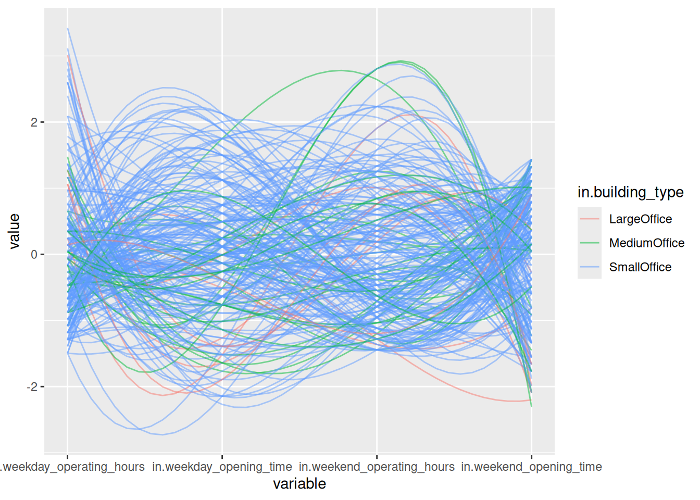
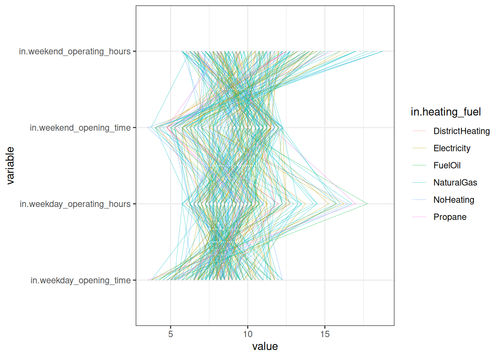

# (PART) Appendix {.unnumbered}

# Cutting room floor

It's worth remembering that most graphs end up on the proverbial cutting room floor. Some graph types in particular are truly hit or miss: parallel coordinate plots are at the top of the list in this category. I'm including some of the "misses" here so you'll realize you're not alone if you create a graph that does not show anything worthwhile.

## Parallel coordinate plots


```r
library(dplyr)
library(forcats)
library(ggplot2)
library(readr)
library(stringr)
library(tibble)
library(tidyr)

oedi_building <- read_csv("data/oedi_building.csv")
oedi_building |>
  filter(str_detect(in.building_type, "Office")) |> 
  GGally::ggparcoord(columns = 1:4, groupColumn = 5, 
                     alphaLines = .5, splineFactor = 10)
```




```r
oedi_building |>
  select(c(starts_with("in.week")), in.heating_fuel) |>
  rownames_to_column("ID") |> 
  pivot_longer(cols = starts_with("in.week"),
               names_to = "variable", values_to = "value") |> 
  ggplot(aes(x = variable, y = value, group = ID, color = in.heating_fuel)) +
  geom_line(lwd = .1) +
  theme_bw() +
  coord_flip()
```




```r
# https://collegescorecard.ed.gov/data
df <- read_csv("data/college_scorecard.csv")

df |> 
  na.omit() |> 
  mutate(COMP_ORIG_YR4_RT = as.numeric(COMP_ORIG_YR4_RT)) |> 
  mutate(WOMENONLY = fct_recode(factor(WOMENONLY), `Women only` = "0", `Not women only` = "1")) |> 
GGally::ggparcoord(columns = 1:4, alphaLines = .5,
                   scale = "globalminmax", groupColumn = 5) +
  theme_bw() +
  theme(legend.position = "bottom", legend.title = element_blank())
```


```r
uk <- read_csv("data/uk_universities.csv",
               col_types = "ccdcddddddnncccccdddc")
uk |> 
  GGally::ggparcoord(columns = c(5, 7, 9:12),
                     alphaLines = .5, groupColumn = 2) + 
  coord_flip()
```


```r
# https://www.strava.com/clubs/537620/leaderboard 
run <- read_csv("data/leaderboard.csv", na = "--")

run$Longest <- parse_number(run$Longest)
run$Distance <- parse_number(run$Distance)
run$Pace <- parse_number(run$`Avg. Pace`)
run$Gain <- parse_number(run$`Elev. Gain`)

run |> 
  filter(Distance < 1000, Rank <= 50) |> 
  select(Athlete, Distance, Runs, Longest, Pace, Gain) |> 
  parcoords::parcoords(rownames = F,
                       reorderable = TRUE,
                       brushMode = "1D-axes")
```

```{=html}
<div class="parcoords html-widget" height="480" id="htmlwidget-324543ee660da305fee8" style="width:672px;height:480px; position:relative; overflow-x:auto; overflow-y:hidden; max-width:100%;" width="672"></div>
<script type="application/json" data-for="htmlwidget-324543ee660da305fee8">{"x":{"data":{"names":["1","2","3","4","5","6","7","8","9","10","11","12","13","14","15","16","17","18","19","20","21","22","23","24","25","26","27","28","29","30","31","32","33","34","35","36","37","38","39","40","41","42","43","44","45","46","47","48","49"],"Athlete":["Falaris F.","willow d.","Evelyn S.","Jose Alberto G.","Michael D.","Setiadi ..","Karan P.","Mohinder S.","Guy S.","Rusty T.","Natalie U.","VICKY  S.","Ăbhïšhëk Sïňğh P.","Evelyn M.","Jopan K.","Brian C.","大胃 L.","Mahetzin B.","Seth K.","Hướng T.","Russian ! V.","APRIL L.","Alvin&Ultan  .","Ade O.","Sam L.","Aldwyn k.","Jeff L.","Parkri 2.","Amal A.","Desi W.","Yen-Chiao H.","Richard K.","Duch L.","Emilee R.","Pete A.","Pagan M.","Kenny A.","Corey M.","Stéphane L.","Shanmukha S.","Peter M.","Robby P.","John W.","Rachael L.","Tim B.","Magdalena S.","Kristoffer M.","Dakotah L.","Thavee N."],"Distance":[112.4,89.2,86.4,85.1,78.8,69.7,69.4,69.1,68.1,67.6,65.3,64.6,64.4,63.5,61.1,60.4,60.2,59.7,58.7,58.5,57.5,57.3,57.2,57.1,56.7,55.5,54.7,54.5,54,53.5,53.1,52.3,52,52,52,51.5,50.8,50.7,50.5,50.4,50.3,50.2,50,49.8,49.6,49.5,48.5,48.3,48.3],"Runs":[4,4,2,6,2,4,3,6,6,2,2,3,3,2,4,5,4,2,3,3,5,4,4,2,6,8,3,10,2,4,3,1,3,4,4,4,8,5,4,3,2,3,3,2,4,2,3,3,1],"Longest":[42.4,32.2,43.4,14.9,40.4,43.1,30.3,20.1,21.9,64.4,43.5,22.2,21.5,32.1,20.8,20.1,15.1,29.9,26.1,26.3,24.9,19.7,43.9,29.1,17.8,12.3,42.4,10.1,29.2,19.3,18,52.3,26.7,24.3,18.1,29.5,13.7,13.7,14.1,21.7,25.2,22.5,33.5,27,17.7,24.8,30.2,24.1,48.3],"Pace":[5,6,12,7,5,7,8,8,6,6,11,6,6,7,7,5,5,6,4,4,8,4,5,10,4,8,7,5,8,4,5,5,6,4,4,4,5,4,5,5,5,4,5,6,4,6,4,4,7],"Gain":[228,996,454,101,171,783,null,412,248,1489,338,39,null,225,42,326,300,270,428,312,528,381,249,361,387,277,null,495,2378,109,83,963,49,328,348,717,379,310,513,314,626,319,736,1484,305,304,12,119,380]},"options":{"rownames":false,"brushMode":"1D-axes","brushPredicate":"AND","reorderable":true,"margin":{"top":50,"bottom":50,"left":100,"right":50},"mode":false,"bundlingStrength":0.5,"smoothness":0},"autoresize":false,"tasks":null},"evals":[],"jsHooks":[]}</script>
```


```r
library(parcoords)
uk |> 
  filter(str_detect(Region, "England")) |> 
  select(University_name, UK_rank, UGfees = `UG_average_fees_(in_pounds)`,
         PGfees = `PG_average_fees_(in_pounds)`,
         International_students, 
         Student_satisfaction,
         COL = `Estimated_cost_of_living_per_year_(in_pounds)`,
         Campus_setting) |> 
 parcoords(rownames = FALSE,
           reorderable = TRUE,
           brushMode = "1D-axes",
           color = list(colorBy = "Campus_setting",
                         colorScale = "scaleOrdinal",
                         colorScheme = "schemeCategory10"),
           withD3 = TRUE,
           width = 770,
           height = 600)
```

```{=html}
<div class="parcoords html-widget" height="600" id="htmlwidget-c92d8c56315199b9dc4a" style="width:770px;height:600px; position:relative; overflow-x:auto; overflow-y:hidden; max-width:100%;" width="770"></div>
<script type="application/json" data-for="htmlwidget-c92d8c56315199b9dc4a">{"x":{"data":{"names":["1","2","3","4","5","6","7","8","9","10","11","12","13","14","15","16","17","18","19","20","21","22","23","24","25","26","27","28","29","30","31","32","33","34","35","36","37","38","39","40","41","42","43","44","45","46","47","48","49","50","51","52","53","54","55","56"],"University_name":["University of Cambridge","University of Oxford","Durham University","Lancaster University","University of Bath","University of Exeter","University of Bristol","University of Manchester","Royal Holloway, University of London","University of Southampton","University of East Anglia UEA","Newcastle University","University of Liverpool","University of Surrey","University of Essex","University of Sussex","University of Reading","University for the Creative Arts","Arts University Bournemouth","University of Lincoln","University of Kent","Edge Hill University","University of Portsmouth","University of the West of England","Liverpool Hope University","Manchester Metropolitan University","Norwich University of the Arts","Oxford Brookes University","Northumbria University","University of Chichester","Falmouth University","University of Central Lancashire","Plymouth University","Liverpool John Moores University","University of Chester","Teesside University","University of Hertfordshire","Royal Agricultural University","Solent University","University of Buckingham","Bournemouth University","University of Gloucestershire","University of Winchester","Bishop Grosseteste University","Plymouth Marjon University","University of Sunderland","Bath Spa University","University of Salford","Buckinghamshire New University","Canterbury Christ Church University","Anglia Ruskin University","University of Cumbria","University of Brighton","University of Bolton","University of Bedfordshire","University of Suffolk"],"UK_rank":[1,2,7,8,11,12,15,18,19,20,23,28,29,32,37,38,38,42,43,51,54,55,56,58,60,62,62,64,65,71,72,75,76,78,79,87,88,89,89,92,94,95,98,102,102,109,110,111,113,118,120,121,122,125,128,129],"UGfees":[21750,21770,14900,14940,14300,15500,15200,14500,13200,14660,14200,12680,13850,13300,12500,14450,14350,11870,12500,12800,12890,11150,11500,11250,10800,11150,12500,12400,11500,10250,12000,11450,12250,11000,10800,10750,11000,10000,10380,17160,13000,11500,11300,10000,9250,8350,11300,11795,9500,11000,10500,10500,12660,11250,9750,9495],"PGfees":[23187,19888,18000,14200,15000,15500,14800,14500,13900,15160,14200,12680,16200,13300,14450,14450,14165,12150,12500,15700,12890,12000,11500,11250,10800,11500,13000,12580,11500,10250,12500,11950,13250,11000,11000,10950,12000,11000,10930,14140,12750,11500,11650,6000,9250,9600,11300,12000,10600,9500,10500,10500,12830,11250,9900,9495],"International_students":[20.2,16.8,17.2,29.6,21.7,21.2,14.9,25,27.4,18.3,20.2,19.6,27,24.4,30.2,27.2,18.9,11.7,13.6,9.4,20.4,1.4,16.6,11.6,1.9,5.8,4.9,15.3,10.5,2.4,6.7,8.5,7.9,4.7,5.4,6.3,14,7.2,13.3,50.5,8.7,3.7,6.1,15.59,15.59,25.1,7.4,11.1,7.6,5.7,10.4,1.5,13.7,6.9,11.7,2.5],"Student_satisfaction":[85.5,86.5,75,79.3,81.8,80.1,77.2,77.2,80.6,78.6,79,78.7,80,78.2,80.3,76.4,75.2,78,82.9,79.3,76.6,79.1,79.3,83.1,79.3,78.9,77.7,77,78.3,79.9,76.5,78.7,79.9,79.1,79.1,79.5,78.3,82.3,79,80.5,75.4,78,78.5,75.8,82.7,77.2,72.2,76.8,79.7,75.7,79,73.8,75.8,82.1,77.4,76],"COL":[12000,11500,8000,8500,11000,8400,7000,9800,7500,7200,9840,8000,7000,10700,8320,12500,8500,8990,6000,9415,8990,8000,6500,8217,7471,8000,9415,8990,8000,8990,8217,7500,7500,7471,7471,8000,9415,9400,7500,8000,8217,8217,10000,7500,8217,8000,8217,7471,8990,8990,9415,6000,8990,5500,9415,9415],"Campus_setting":["Urban","Urban","Urban","Rural","Suburban","Suburban","Urban","Urban","Suburban","Suburban","Suburban","Urban","Urban","Suburban","Suburban",null,null,null,null,"Urban","Suburban","Rural","Urban","Suburban","Suburban",null,"Urban","Urban","Urban","Suburban",null,"Urban",null,"Urban","Urban","Urban","Suburban","Rural","Urban","Rural","Urban","Suburban","Suburban","Urban",null,"Urban","Rural","Urban","Suburban","Urban","Urban",null,null,"Urban","Urban",null]},"options":{"rownames":false,"color":{"colorBy":"Campus_setting","colorScale":"scaleOrdinal","colorScheme":"schemeCategory10"},"brushMode":"1D-axes","brushPredicate":"AND","reorderable":true,"margin":{"top":50,"bottom":50,"left":100,"right":50},"mode":false,"bundlingStrength":0.5,"smoothness":0,"width":770,"height":600},"autoresize":false,"tasks":null},"evals":[],"jsHooks":[]}</script>
```


