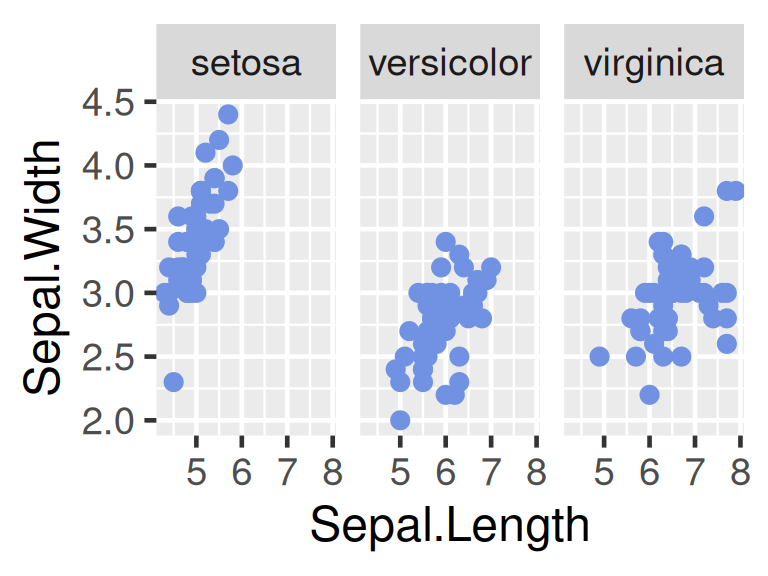
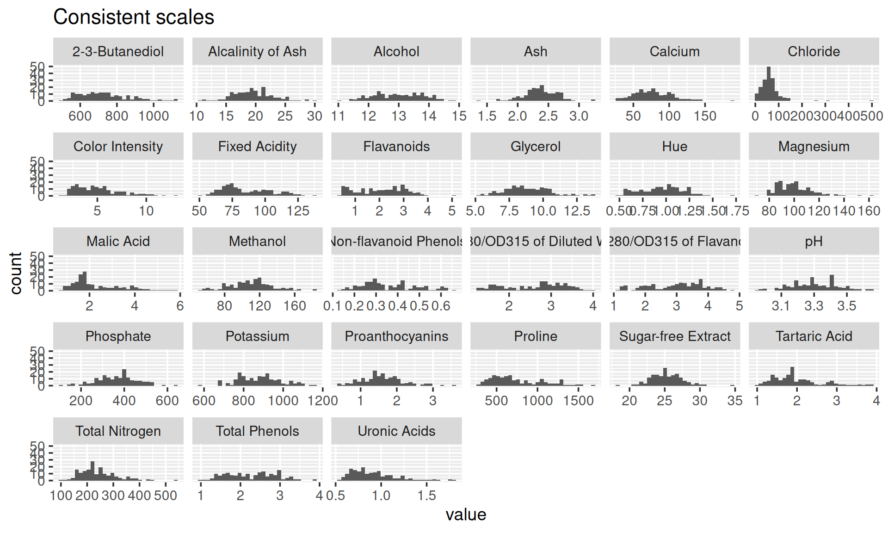

# Faceting

In this chapter, we will introduce facets, which are usually used to combine continuous and categorical data.

## Faceting on one variable

Facet partitions a plot into a matrix of panels. Each panel shows a different subset of the data. By default, ``facet_wrap`` gives consistent scales, which is easier for comparison between different panels.


```r
library(ggplot2)
mycol = "#7192E3"  
ggplot(iris, aes(Sepal.Length, Sepal.Width)) +  
  geom_point(color = mycol) +  
  facet_wrap(~Species) +  
  theme_grey(18)
```



Rather than faceting on factor level, we can have one panel for each numerical variable.


```r
library(pgmm) 
library(dplyr)
library(tidyr)
data(wine)  
tidywine <- wine %>% 
  pivot_longer(cols = -Type, names_to = "variable", values_to = "value")  
tidywine %>%  
  ggplot(aes(value)) +  
  geom_histogram() +  
  facet_wrap(~variable) +   
  ggtitle("Consistent scales") +  
  theme_grey(14)
```


Axis scales can be made independent, by setting scales to ``free``, ``free_x``, or ``free_y``. 

In this case, ``scales = "free_x"`` is a better option because the distribution of each numerical variable is more obvious.


```r
tidywine  %>%
  ggplot(aes(value)) +
  geom_histogram() +
  facet_wrap(~variable,scales = "free_x") +
  ggtitle("Consistent scales") +
  theme_grey(14)
```



##  Faceting on two variables

``facet_grid`` can be used to split data-sets on two variables and plot them on the horizontal and/or vertical direction.


```r
wine %>%   
  mutate(Type = paste("Type", Type)) %>%   
  select(1:6) %>%   
  pivot_longer(cols = -Type, names_to = "variable", values_to = "value") %>%  
  ggplot(aes(value)) +  
  geom_histogram(color = mycol, fill = "lightblue") +  
  facet_grid(Type ~ variable, scales = "free_x") +  
  theme_grey(14)
```


