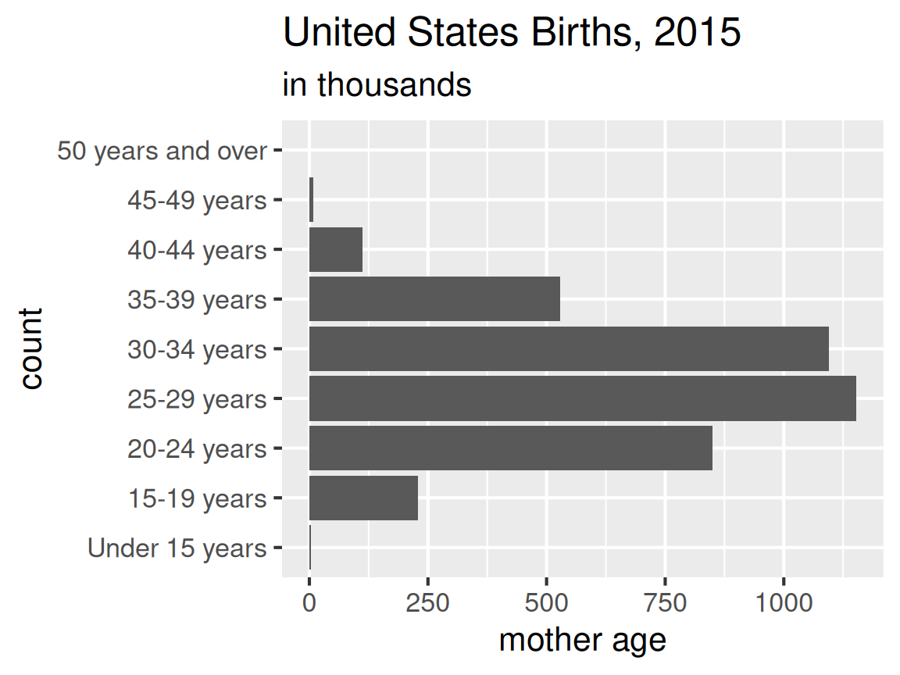
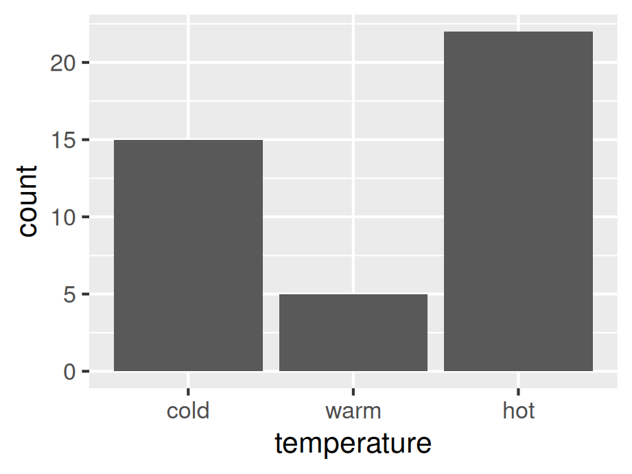
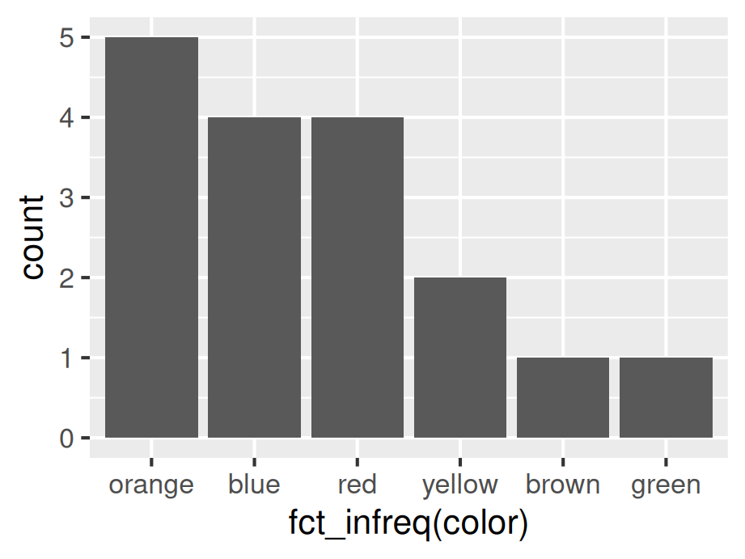
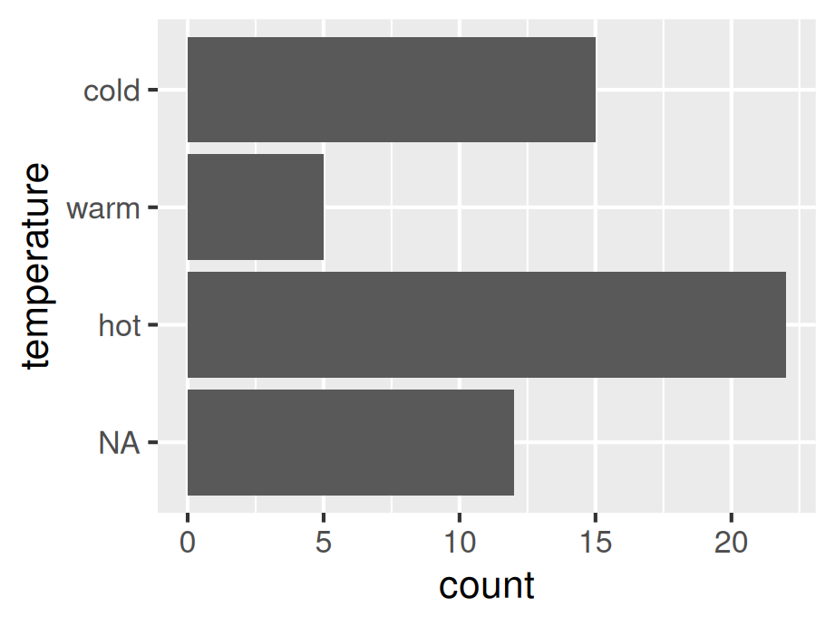

# Working with factors

As what we have mentioned in the previous chapter, R sorts levels of factors in alphabetical order by default. In this chapter we will talk about working with factors using **forcats** package, which can be helpful when you managing categorical variables.

## Recode factor levels

**Don't** directly assign levels with ``levels()<-``. Instead, using ``fct_recode()``.


```r
library(forcats)
x <- factor(c("G234", "G452", "G136"))  
y <- fct_recode(x, Physics = "G234", Math = "G452", Chemistry = "G136")  
y
```

```
## [1] Physics   Math      Chemistry
## Levels: Chemistry Physics Math
```

## Relevel the factor

For the binned, ordinal data with levels out of order, ``fct_relevel()`` can be used to set a correct order. 


```r
library(tibble)
library(ggplot2)
Births2015 <- tibble(MotherAge = c("15-19 years", "20-24 years", "25-29 years", "30-34 years", "35-39 years",  "40-44 years", "45-49 years", "50 years and over", "Under 15 years"), Num = c(229.715, 850.509, 1152.311, 1094.693, 527.996, 111.848, 8.171, .754, 2.5)) 
 
ggplot(Births2015, aes(fct_relevel(MotherAge, "Under 15 years"), Num)) +
  geom_col() +
  coord_flip() +
  scale_y_continuous(breaks = seq(0, 1250, 250)) +
  ggtitle("United States Births, 2015", subtitle = "in thousands") +
  theme_grey(16) +
  labs(y = "mother age", x = "count")
```




The following examples give three circumstances when using ``fct_relevel()``.

1. Using ``fct_relevel()`` to move levels to the beginning:


```r
x <- c("A", "B", "C", "move1", "D", "E", "move2", "F")  
fct_relevel(x, "move1", "move2")
```

```
## [1] A     B     C     move1 D     E     move2 F    
## Levels: move1 move2 A B C D E F
```

2. Using ``fct_relevel()`` to move levels after an item (by position):


```r
x <- c("A", "B", "C", "move1", "D", "E", "move2", "F")  
fct_relevel(x, "move1", "move2", after = 4) # move after the fourth item
```

```
## [1] A     B     C     move1 D     E     move2 F    
## Levels: A B C D move1 move2 E F
```

3. Using ``fct_relevel()`` to move levels to the end


```r
x <- c("A", "B", "C", "move1", "D", "E", "move2", "F")  
fct_relevel(x, "move1", "move2", after = Inf)
```

```
## [1] A     B     C     move1 D     E     move2 F    
## Levels: A B C D E F move1 move2
```

If the row order is correct, use ``fct_inorder()``:


```r
df <- data.frame(temperature = factor(c("cold", "warm", "hot")),  
                 count = c(15, 5, 22)) 
 
# row order is correct (think: factor in ROW order) 
ggplot(df, aes(x = fct_inorder(temperature), y = count)) +  
  geom_col() +
  theme_grey(16) +
  labs( x = "temperature")
```




## Reorder the factors 

Usually, unbinned, nominal data should be sorted by frequency order, which can be achieved using ``fct_infreq()`` (default is decreasing order of frequency)


```r
df <- data.frame(  
  color = c("orange","blue", "red","brown","yellow", "green", "orange", "red", "yellow","blue","blue","red","orange","blue","red","orange","orange")
)  
 
ggplot(df, aes(fct_infreq(color))) +   
  geom_bar() +  
  theme_grey(16)
```




For binned, nominal data which should be sorted by frequency order, use ``fct_reorder()``. In the following example **count** is used, generally you can also apply **mean**,**median**, etc. to ``.fun`` inside `fct_reorder()``.


```r
pack1 <- data.frame(  
  color = c("blue", "brown", "green", "orange", "red", "yellow"),  
  count = c(13, 7, 12, 9, 7, 8)  
)  
 
ggplot(pack1, aes(fct_reorder(color, count, .desc = TRUE), count)) +   
  geom_col() +  
  theme_grey(16) +
  labs(x = "color")
```


## Dealing wirh NAs

For prominent NA bars which should not be eliminated, use ``fct_explicit_na(x)``. And using ``fct_rev(x)`` to reverse the factor level **doesn't** help.


```r
library(dplyr)
df <- data.frame(temperature = factor(c("cold", "warm", "hot", NA)), count = c(15, 5, 22, 12))
 
df %>%   
  mutate(temperature = fct_explicit_na(temperature, "NA") %>% 
  fct_relevel("NA", "hot", "warm", "cold")) %>%
  ggplot(aes(x = temperature, y = count)) +
  geom_col() +
  coord_flip() +
  theme_grey(16) +
  labs(x = "temperature")
```



## Summary of useful functions

For analyzing categorical variables, the first step is always to decide whether the class is ordinal or nominal.

>fct_recode(x, ...) – change names of levels
>
>fct_inorder(x) – set level order of x to row order
>
>fct_relevel(x, ...) – manually set the order of levels of x
>
>fct_reorder(x, y) – reorder x by y
>
>fct_infreq(x) – order the levels of x by decreasing frequency
>
>fct_rev(x) – reverse the order of factor levels of x
>
>fct_explicit_na(x) – turn NAs into a real factor level
>

## Continuous to Categorical

Sometimes you want to transfer a continuous variable to a categorical variable. For example, you might want assign grades to final scores of a course. In the following example, we generated a data set of test scores randomly and we assign grades based on some thresholds. We then apply function `cut`. (You can similarly use `case_when`)


```r
set.seed(2022)
testscore <- round(runif(100, min = 70, max = 100))

df <- data.frame(testscore) |> 
  mutate(grade = cut(testscore, breaks = seq(70, 100, 10), 
                     labels = c("C", "B", "A"), right = FALSE,
                     include.lowest = TRUE))

head(df)
```

```
##   testscore grade
## 1        94     A
## 2        89     B
## 3        74     C
## 4        86     B
## 5        76     C
## 6        89     B
```
