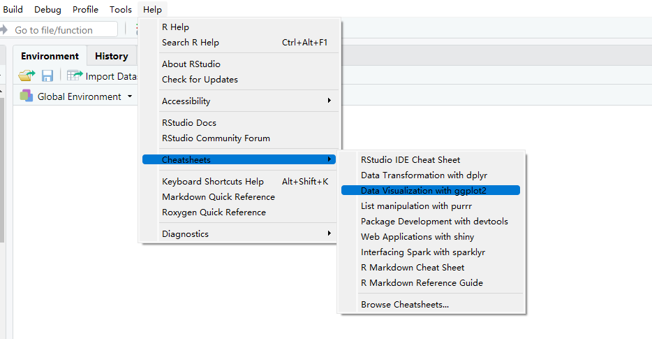

# (PART) R graphics {-}

# Learning ggplot2

## **Getting started**

Hopefully, most of you already have experiences in plotting basic R graphics. In this Chapter, you will be briefly introduced one of the most powerful plotting packages in R: ``ggplot2`` with it's basic grammar and functions. To start, install ``ggplot2`` in the console or in R chunk.

```
install.packages('ggplot2')
```


## **Default part: layer**

For many R beginners, the question is always like: why is ggplot? One remarkable feature of ``ggplot2`` is having an underlying grammar which enables you to compose graphs by combining different components. You can easily create novel graphics by adding ``ggplot2`` functions to meet your needs based on your data. 

By definition of the grammar of graphics, the most important features are data and mapping in the layers and that's where we are getting started.

```{r,fig.width=4, fig.height=3}
library(ggplot2)

ggplot(data = iris) +  #Data part
  geom_point(aes(Sepal.Length, Sepal.Width))  #Mapping part
```

The most important part of all plots is data, which includes the information you want to visualize. Based on that, the next step is to decide its mapping, which determine how the data's variable are mapped to aesthetic attributes on a graphic. Since data is independent from the other elements, you can always add several layers of data into the same ggplot while keeping the other components the same.

```{r,fig.width=4, fig.height=3}
ggplot(data = iris) +  #Data part
  geom_point(aes(Petal.Length, Petal.Width)) +  #layer 1 with mapping 
  geom_point(aes(Sepal.Length, Sepal.Width), color='red')  #layer 2 with a different mapping
```


## **Customized parts**

The following picture shows the order of ggplot functions:

<center>
{width=60%}
</center>

For more function order suggestions and auto-correction when writing your own ``ggplot2`` functions, please refer to [ggformat](https://github.com/jtr13/ggformat) addin created by Joyce.


### **Geometric object, statistical transformation and position adjustment**

<center>

</center>

Geometric object, Statistical transformation and Position adjustment are components that can be customized in each layer.

Geometric objects ``geoms`` control the type of plot you create. Different types of plot have different aesthetics features. For example, a point geom has position, color, shape, and size aesthetics. You should first decide which kind of plot better explains the data before choosing ``geoms`` and use ``help`` function to check what aesthetics can be modified to achieve your desired effects.

A statistical transformation ``stat`` transforms the data. And Position adjustment is applied when you need to adjust the position of elements on the plot for dense data, otherwise data points might obscure one another.

```{r,fig.width=4.8, fig.height=3.6}
ggplot(data = iris) +
  geom_histogram(mapping=aes(x=Petal.Length, fill=Species), stat = 'bin',position = 'stack')
```


### **Scale**

<center>
{width=50%}
</center>

A scale controls how data is mapped to aesthetic attributes, so one scale for one layer.

```{r,fig.width=4.8, fig.height=3.6}
ggplot(data = iris) +
  geom_histogram(mapping=aes(x=Petal.Length, fill=Species), stat = 'bin',position = 'stack') +
  scale_x_continuous(limits = c(0, 10)) +
  scale_y_continuous(limits = c(0, 50))
```


### **Coordinate system**

A coordinate system ``coord`` maps the position of objects onto the plane of the plot, and controls how the axes and grid lines are drawn. One ggplot can only have one ``coord``

```{r,fig.width=4.8, fig.height=3.6}
ggplot(data = iris) +
  geom_histogram(mapping=aes(x=Petal.Length, fill=Species), stat = 'bin',position = 'stack') +
  coord_polar()
```


### **Faceting**

Faceting can be used to split the data up into subsets of the entire dataset. 

```{r,fig.width=4.8, fig.height=3.6}
ggplot(data = iris) +
  geom_histogram(mapping=aes(x=Petal.Length), stat = 'bin') +
  facet_wrap(iris$Species)
```


### **Labels**

Labels include titles, labels for x,y axis and annotates. Good graphics also need to give clear information by using labels to tell readers' of the background knowledge of your data.

```{r,fig.width=4.8, fig.height=3.6}
ggplot(data = iris) +
  geom_histogram(mapping=aes(x=Petal.Length, fill=Species), stat = 'bin',position = 'stack') +
  ggtitle('Stacked petal length of different species') +
  xlab('Length of Petal')
```


## **Resources for ggplot2**

- For more implementations and examples, one easiest way is referring to the ggplot2 Cheatsheets provided by R. Follow the steps shown below and you can find the cheat-sheets in your RStudio. 

<center>
{width=75%}
</center>

The cheat-sheets clearly list the basic components of a ggplot where you can customize your unique plot by choosing different functions.

- If you are seeking for more detailed explanations and examples with real datasets, here are some useful links for you: 

1. [ggplot2: Elegant Graphics](https://ggplot2-book.org/)

2. [ggformat](https://github.com/jtr13/ggformat)