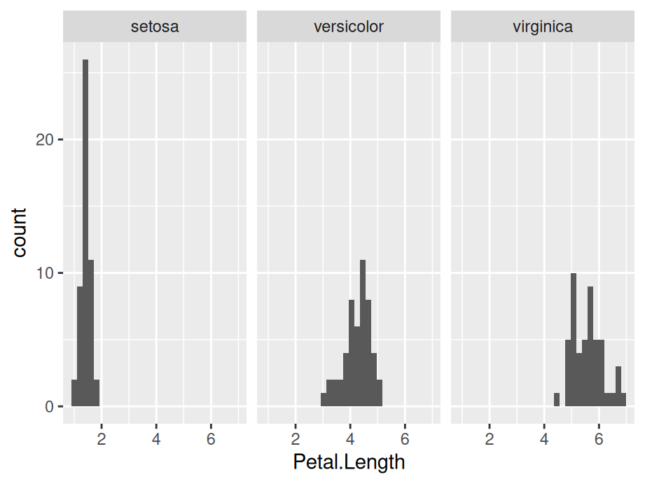

# (PART) R graphics {-}

# Learning ggplot2

## **Getting started**

Make sure you have installed the **tidyverse** collection of packages with:


```r
install.packages("tidyverse")
```

To use **ggplot2** you can either call the library with


```r
library(tidyverse)
```

to load all **tidyverse** packages or:


```r
library(ggplot2)
```

for the **ggplot2** package only.

## Grammar of Graphics

Unlike many graphics software packages, **ggplot2** has an underlying grammar which enables you to create graphs by combining different basic components or building blocks. Therefore you are not limited by a list of premade charts but can design your own unique graphics given your data and research goals.

The underlying grammar is called the Grammar of Graphics based on [a book by Leland Wilkinson](https://www.amazon.com/Grammar-Graphics-Statistics-Computing/dp/0387245448) with the same title. (That is what the "gg" in **ggplot2** stands for.)

As implemented in **ggplot2** the five basic components of graphs are 1) layers, 2) scales, 3) coordinate system, 4) faceting system, and 5) theme.

The layers contain the data; everything else in a sense helps us to view and interpret the data. Plots contain one or more layers.

## Data layers


```r
knitr::include_graphics("images/layers.png")
```


Data layers are made up of: 1) data, 2) a geom, 3) aesthetic mappings, 4) stat, and 5) position. The first three are required; the second two are optional and will rarely need to be changed from the default settings. So, let's focus on data, geom and aesthetic mappings. Data refers simply to the data frame you are working with. Note that **ggplot2** requires a `data.frame` or `tibble`. You cannot plot with other data structures such as vectors, matrices, or lists.

Geom stands for geometric object, which you can think of as the shape in which the data will appear in your graph. Common geoms are point, 
bar, boxplot, line, histogram, and density. Each geom has a certain number of required pieces of information. For example, to draw a point, you need two pieces of information, an x and a y. These pieces of information are called aesthetic mappings. Let's say we want to create a scatterplot. We start by recognizing that our graph will contain points so the geom we need is `geom_point()`. Next we have to 


```r
library(ggplot2)

ggplot(data = iris) +  #Data part
  geom_point(aes(x = Sepal.Length, y = Sepal.Width))  #Mapping part
```


The most important part of all plots is data, which includes the information you want to visualize. Based on that, the next step is to decide its mapping, which determine how the data's variable are mapped to aesthetic attributes on a graphic. Since data is independent from the other elements, you can always add several layers of data into the same ggplot while keeping the other components the same.


```r
ggplot(data = iris) +  #Data part
  geom_point(aes(Petal.Length, Petal.Width)) +  #layer 1 with mapping 
  geom_point(aes(Sepal.Length, Sepal.Width), color='red')  #layer 2 with a different mapping
```


## **Customized parts**

The following picture shows the order of ggplot functions:

<center>
{width=60%}
</center>

For more function order suggestions and auto-correction when writing your own **ggplot2** functions, please refer to [ggformat](https://github.com/jtr13/ggformat) addin created by Joyce.


### **Geometric object, statistical transformation and position adjustment**

Geometric object, statistical transformation and position adjustment are components that can be customized in each layer.

Geometric objects, called `geoms`, control graphical elements representing the data--think shapes. Different types of plot have different aesthetics features. For example, a point `geom` has position, color, shape, and size aesthetics. You should first decide which kind of plot better explains the data before choosing `geoms` and use `help` function to check what aesthetics can be modified to achieve your desired effects.

A statistical transformation `stat` transforms the data. And Position adjustment is applied when you need to adjust the position of elements on the plot for dense data, otherwise data points might obscure one another.


```r
ggplot(data = iris) +
  geom_histogram(mapping=aes(x=Petal.Length, fill=Species), stat = 'bin',position = 'stack')
```


### **Scale**

<center>
{width=50%}
</center>

A scale controls how data is mapped to aesthetic attributes, so one scale for one layer.


```r
ggplot(data = iris) +
  geom_histogram(mapping=aes(x=Petal.Length, fill=Species), stat = 'bin',position = 'stack') +
  scale_x_continuous(limits = c(0, 10)) +
  scale_y_continuous(limits = c(0, 50))
```


### **Coordinate system**

A coordinate system `coord` maps the position of objects onto the plane of the plot, and controls how the axes and grid lines are drawn. One ggplot can only have one `coord``


```r
ggplot(data = iris) +
  geom_histogram(mapping=aes(x=Petal.Length, fill=Species), stat = 'bin',position = 'stack') +
  coord_polar()
```


### **Faceting**

Faceting can be used to split the data up into subsets of the entire dataset. 


```r
ggplot(data = iris) +
  geom_histogram(mapping=aes(x=Petal.Length), stat = 'bin') +
  facet_wrap(iris$Species)
```




### **Labels**

Labels include titles, labels for x,y axis and annotates. Good graphics also need to give clear information by using labels to tell readers' of the background knowledge of your data.


```r
ggplot(data = iris) +
  geom_histogram(mapping=aes(x=Petal.Length, fill=Species), stat = 'bin',position = 'stack') +
  ggtitle('Stacked petal length of different species') +
  xlab('Length of Petal')
```


## **Resources for ggplot2**

- For more implementations and examples, one easiest way is referring to the ggplot2 Cheatsheets provided by R. Follow the steps shown below and you can find the cheat-sheets in your RStudio. 

<center>
{width=75%}
</center>

The cheat-sheets clearly list the basic components of a ggplot where you can customize your unique plot by choosing different functions.

- If you are seeking for more detailed explanations and examples with real datasets, here are some useful links for you: 

1. [ggplot2: Elegant Graphics](https://ggplot2-book.org/)

2. [ggformat](https://github.com/jtr13/ggformat)

## Required aesthetic mappings


|GEOM                   |REQUIRED MAPPINGS                            |
|:----------------------|:--------------------------------------------|
|geom_abline            |NA                                           |
|geom_area              |x and y                                      |
|geom_bar               |x or y                                       |
|geom_bin_2d            |x and y                                      |
|geom_bin2d             |x and y                                      |
|geom_blank             |NA                                           |
|geom_boxplot           |x or y                                       |
|geom_col               |x and y                                      |
|geom_contour           |x, y, and z                                  |
|geom_contour_filled    |x, y, and z                                  |
|geom_count             |x and y                                      |
|geom_crossbar          |x, y, ymin, and ymax or x, y, xmin, and xmax |
|geom_curve             |x, y, xend, and yend                         |
|geom_density           |x or y                                       |
|geom_density_2d        |x and y                                      |
|geom_density_2d_filled |x and y                                      |
|geom_density2d         |x and y                                      |
|geom_density2d_filled  |x and y                                      |
|geom_dotplot           |x                                            |
|geom_errorbar          |x, ymin, and ymax or y, xmin, and xmax       |
|geom_errorbarh         |xmin, xmax, and y                            |
|geom_freqpoly          |x or y                                       |
|geom_function          |NA                                           |
|geom_hex               |x and y                                      |
|geom_histogram         |x or y                                       |
|geom_hline             |yintercept                                   |
|geom_jitter            |x and y                                      |
|geom_label             |x, y, and label                              |
|geom_line              |x and y                                      |
|geom_linerange         |x, ymin, and ymax or y, xmin, and xmax       |
|geom_map               |NA                                           |
|geom_path              |x and y                                      |
|geom_point             |x and y                                      |
|geom_pointrange        |x, y, ymin, and ymax or x, y, xmin, and xmax |
|geom_polygon           |x and y                                      |
|geom_qq                |sample                                       |
|geom_qq_line           |sample                                       |
|geom_quantile          |x and y                                      |
|geom_raster            |x and y                                      |
|geom_rect              |xmin, xmax, ymin, and ymax                   |
|geom_ribbon            |x, ymin, and ymax or y, xmin, and xmax       |
|geom_rug               |NA                                           |
|geom_segment           |x, y, xend, and yend                         |
|geom_sf                |geometry                                     |
|geom_sf_label          |geometry                                     |
|geom_sf_text           |geometry                                     |
|geom_smooth            |x and y                                      |
|geom_spoke             |x, y, angle, and radius                      |
|geom_step              |x and y                                      |
|geom_text              |x, y, and label                              |
|geom_tile              |x and y                                      |
|geom_violin            |x and y                                      |
|geom_vline             |xintercept                                   |

 
