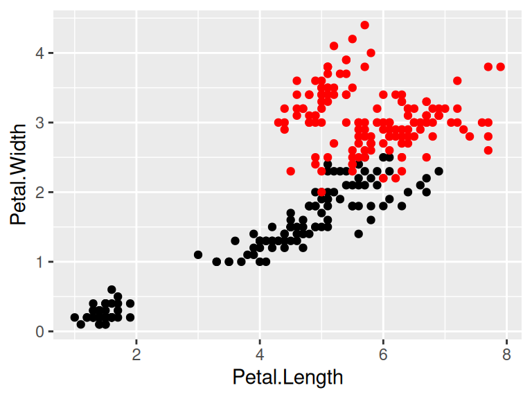

# Learning ggplot2

*This is a page working in progress :)*

## Getting Started

Hopefully, most of you already have experiences in plotting basic R graphics. In this Chapter, you will be briefly introduced one of the most powerful plotting packages in R: ``ggplot2`` with it's basic grammar and functions.


## Default Part: Layer

Unlike other graphics packages, one of the remarkable advantages of ``ggplot2`` is having an underlying grammar which enables you to compose graphs by combining different components. You can easily create novel graphics by adding ``ggplot2`` functions to meet your needs based on your data. 

By definition of the grammar of graphics, the most important features are data and mapping in the layers and that's where we are getting started.


```r
library(ggplot2)
library(datasets)

# Using 'iris' in 'datasets' library as data
ggplot(data = datasets::iris) +  #Data part
  geom_point(aes(Sepal.Length, Sepal.Width))  #Mapping part
```


All plots are composed of the data, the information you want to visualize, and a mapping, the description of how the data’s variables are mapped to aesthetic attributes. Because data is independent from the other elements, a layered graphic can be built which utilizes different data sources while keeping the other components the same. That is to say, you can add several layers into the same ggplot.


```r
ggplot(data = datasets::iris) +  #Data part
  geom_point(aes(Petal.Length, Petal.Width)) +  #layer 1 with mapping 
  geom_point(aes(Sepal.Length, Sepal.Width), color='red')  #layer 2 with a different mapping
```


## Customized Parts

### Geometric object, Statistical transformation and Position adjustment


Geometric object, Statistical transformation and Position adjustment are components that can be customized in each layer.

Geometric objects ``geoms`` control the type of plot you create. Each ``geom`` can only display certain aesthetics or visual attributes of the geom. For example, a point geom has position, color, shape, and size aesthetics. You should first decide which kind of plot better explains the data before choosing ``geoms`` and use ``help`` function to check what aesthetics can be modified to achieve your desired effects.

A statistical transformation ``stat`` transforms the data, generally by summarizing the information. And Position adjustment is applied when you need to adjust the position of elements on the plot for dense data, otherwise data points might obscure one another.


```r
ggplot(data = datasets::iris) + 
  geom_histogram(mapping=aes(x=Petal.Length, fill=Species), stat = 'bin',position = 'stack') 
```


### Scale


A scale controls how data is mapped to aesthetic attributes, so usually one scale for every aesthetic property employed in a layer.

```r
ggplot(data = datasets::iris) + 
  geom_histogram(mapping=aes(x=Petal.Length, fill=Species), stat = 'bin',position = 'stack')+
  scale_x_continuous(limits = c(0, 10)) +
  scale_y_continuous(limits = c(0, 50))
```


### Coordinate system

A coordinate system ``coord`` maps the position of objects onto the plane of the plot, and controls how the axes and grid lines are drawn. One ggplot can only have one ``coord``


```r
ggplot(data = datasets::iris) + 
  geom_histogram(mapping=aes(x=Petal.Length, fill=Species), stat = 'bin',position = 'stack')+
  coord_polar()
```


### Faceting

Faceting can be used to split the data up into subsets of the entire dataset. 


```r
ggplot(data = datasets::iris) + 
  geom_histogram(mapping=aes(x=Petal.Length), stat = 'bin')+
  facet_wrap(iris$Species)
```



### Labels

Labels include titles, labels for x,y axis and annotates. Good graphics also need to give clear information by using labels to tell readers' of the background knowledge of your data.


```r
ggplot(data = datasets::iris) + 
  geom_histogram(mapping=aes(x=Petal.Length, fill=Species), stat = 'bin',position = 'stack')+
  ggtitle('Stacked Histogram on Petal Length of Different Species') +
  xlab('Length of Petal')
```


## ggplot2 Resources

- For more implementations and examples, one easiest way is referring to the ggplot2 Cheatsheets provided by R. Follow the steps shown below and you can find the cheat-sheets in your RStudio. 


The cheat-sheets clearly list the basic components of a ggplot where you can customize your unique plot by choosing different functions.


- If you are seeking for more detailed explanations and examples with real datasets, here are some useful links for you:

 1. [ggplot2: Elegant Graphics](https://ggplot2-book.org/)
