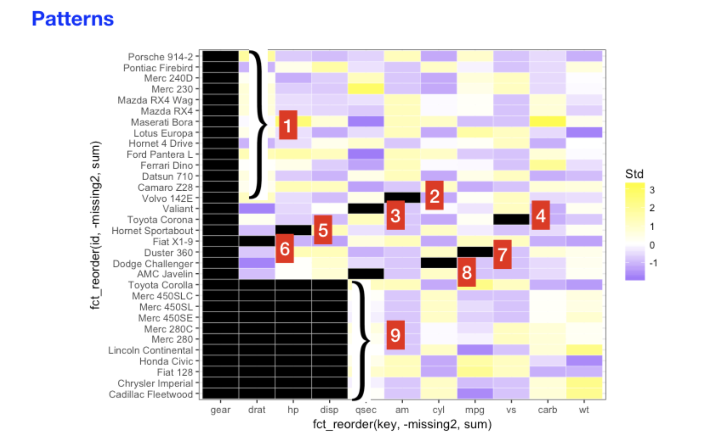

# Missing data

## Introduction 

Regardless what kind of data you have, missing data is a common issue. In this chapter, we will talk about missing data. Our focus will be on visualizing missing data and patterns to help you better understand your data. 

## Row / Column missing patterns

Let's consider the following two problem:

* Do all rows / columns have the same percentage of missing values?

* Are there correlations between missing rows / columns? (If a value is missing in one column it is likely to be missing in another column.)

We will explore these two problems using `mtcars` with artificially generated missing values. 


```r
library(dplyr)
library(tibble)
library(tidyr)
library(ggplot2)
library(forcats)

set.seed(5702)
mycars <- mtcars
mycars[,"gear"] <- NA
mycars[10:20, 3:5] <- NA
for (i in 1:10) mycars[sample(32,1), sample(11,1)] <- NA
```

### colSums() / rowSums()

The most straightforward way to check missing values is using `is.na()` wrapped in `colSums()` / `rowSums()`. You will be able to observe the number of missing values column or row-wise.


```r
colSums(is.na(mycars)) %>%
  sort(decreasing = TRUE)
```

```
## gear disp   hp drat   am  cyl qsec   vs  mpg   wt carb 
##   32   12   12   11    3    1    1    1    0    0    0
```


```r
#Show only the head
rowSums(is.na(head(mycars))) %>%
  sort(decreasing = TRUE)
```

```
##         Mazda RX4     Mazda RX4 Wag        Datsun 710    Hornet 4 Drive 
##                 1                 1                 1                 1 
## Hornet Sportabout           Valiant 
##                 1                 1
```

### Heatmap

A graph can be more informative than plain numbers. If there are not a lot of rows or columns, we can use heatmaps to visualize the missing values. 


```r
tidycars <- mycars %>% 
    rownames_to_column("id") %>% 
    gather(key, value, -id) %>% 
    mutate(missing = ifelse(is.na(value), "yes", "no"))
```


```r
ggplot(tidycars, aes(x = key, y = fct_rev(id), fill = missing)) +
  geom_tile(color = "white") + 
  ggtitle("mtcars with NAs added") +
  ylab('') + 
  scale_fill_viridis_d() + # discrete scale
  theme_bw()
```


In the above example, we can clearly see where the missing values are for both rows and columns. 

Now, to add more information to the graph, consider the following example:


```r
tidycars <- tidycars %>% group_by(key) %>% 
  mutate(Std = (value-mean(value, na.rm = TRUE))/sd(value, na.rm = TRUE)) %>% ungroup()

ggplot(tidycars, aes(x = key, y = fct_rev(id), fill = Std)) +
  geom_tile(color = "white") + 
  ylab('') + 
  scale_fill_gradient2(low = "blue", mid = "white", high ="yellow", na.value = "black") + theme_bw()
```


In this graph, black represents missing values. The color scale from purple to yellow represents the magnitude of the values.

### Patterns

Other than the actual location of missing values, we can also explore the  missing patterns. A Missing pattern refer to the combination of columns missing. The following picture should be a great demonstration of the concept.



To explore the patterns, we use `plot_missing()` from `redav`.


```r
library(redav)
plot_missing(mycars, percent = FALSE)
```


Notice that there are three parts in the aggregated graph. The top part shows the number of missing values in each column. The middle part presents the missing patterns and the right part shows the counts for each missing patterns. You can also show the percentage in the top/right graphs by setting `percentage = True`.
