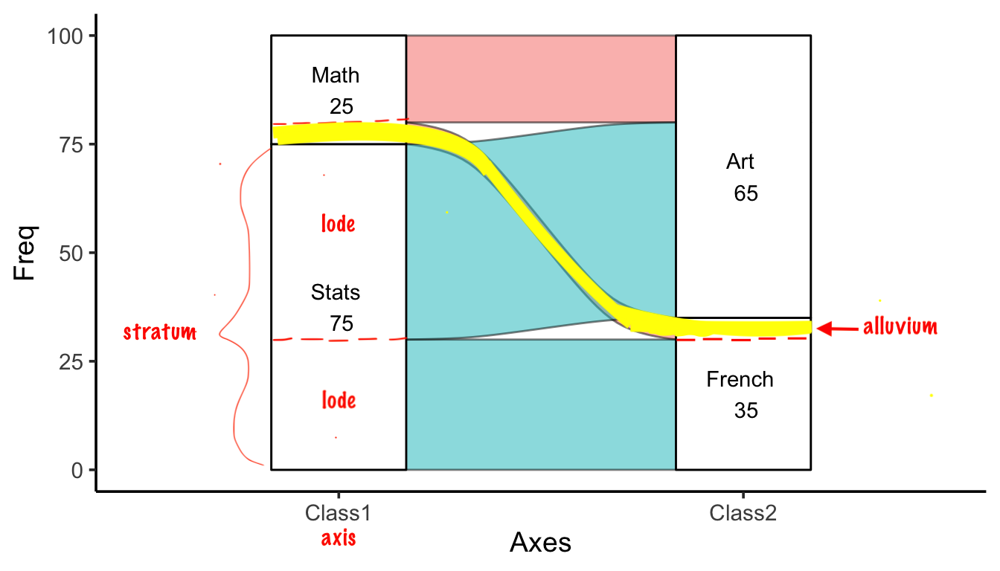

# Multidimensional categorical variables

In this chapter, we will focus on multivariate categorical data. Here, it is noteworthy that multivariate plot is not the same as multiple variable plot, where the former is used for analysis with multiple outcomes. 

## Barcharts

Bar chats are used to display the frequency of multidimensional categorical variables. In the next few plots you will be shown different kinds of bar charts.

### Stacked bar chart

```{r,fig.width=4, fig.height=3}
library(ggplot2)
library(dplyr)
library(tidyr)
cases <- read.csv("data/icecream.csv")
icecreamcolors <- c("#ff99ff", "#cc9966") # pink, coffee
ggplot(cases, aes(x = Age, fill = Favorite)) + 
    geom_bar() + scale_fill_manual(values = icecreamcolors)
```

### Grouped bar chart

Use ``position = "dodge"`` to create grouped bar chart

```{r,fig.width=4, fig.height=3}
ggplot(cases, aes(x = Age, fill = Favorite)) +
  geom_bar(position = "dodge") +
  scale_fill_manual(values = icecreamcolors)
```

### Grouped bar chart with facets

```{r,fig.width=4, fig.height=3}
ggplot(cases, aes(x = Age)) +
  geom_bar(position = "dodge") +
  facet_wrap(~Favorite)
```

### Grouped barchart with three categorical variables

```{r,fig.width=4, fig.height=3}
counts3 <- cases %>%
  group_by(Age, Favorite, Music) %>%
  summarize(Freq = n()) %>%
  ungroup() %>%
  complete(Age, Favorite, Music, fill = list(Freq = 0))

ggplot(counts3, aes(x = Favorite, y = Freq, fill = Music)) +
  geom_col(position = "dodge") +
  facet_wrap(~Age)
```


## Chi square test of independence

In this section, we would like to show how to use chi-square test to check the independence between two features.

We will use the following example to answer: Are older Americans more interested in local news than younger Americans? The dataset is collected from [here](https://www.journalism.org/2019/08/14/methodology-local-news-demographics/).

```{r,fig.width=4.8, fig.height=3.6}
local <- data.frame(Age = c("18-29", "30-49", "50-64", "65+"),
                        Freq = c(2851, 9967, 11163, 10911)) %>%
  mutate(Followers = round(Freq*c(.15, .28, .38, .42)),
         Nonfollowers = Freq - Followers) %>%
  select(-Freq)
knitr::kable(local[,1:2])
```

The chi-square hypothesis is set to be:

Null hypothesis: Age and tendency to follow local news are independent

Alternative hypothesis: Age and tendence to follow local news are NOT independent

```{r,fig.width=4.8, fig.height=3.6}
localmat <- as.matrix(local[,2:3])
rownames(localmat) <- local$Age
X <- chisq.test(localmat, correct = FALSE)
X$observed
X$expected
X
```

We compare observed to expected and then the p-value tells that age and tendency are independent features. We are good to move on to next stage on mosaic plots.


## Mosaic plots

Mosaic plots are used for visualizing data from two or more qualitative variables to show their proportions or associations.

### Mosaic plot with one variable

```{r,fig.width=4.8, fig.height=3.6}
library(grid)
icecream <- read.csv("data/MusicIcecream.csv")
icecreamcolors <- c("#ff99ff", "#cc9966") 
counts2 <- icecream %>%
  group_by(Age, Favorite) %>%
  summarize(Freq = sum(Freq))
vcd::mosaic(~Age, direction = "v", counts2)
```

### Mosaic plot with two variables

```{r,fig.width=4.8, fig.height=3.6}
vcd::mosaic(Favorite ~ Age, counts2, direction = c("v", "h"),
            highlighting_fill = icecreamcolors)
```

### Mosaic plot with three variables(Best practice)

Here's some criteria of best practice of mosaic plots :

>Dependent variables is split last and split horizontally
>
>Fill is set to dependent variable
>
>Other variables are split vertically
>
>Most important level of dependent variable is closest to the x-axis and darkest (or most noticable shade)
>

```{r,fig.width=4.8, fig.height=3.6}
vcd::mosaic(Favorite ~ Age + Music, counts3,
            direction = c("v", "v", "h"),
            highlighting_fill = icecreamcolors)
```

### Mosaic pairs plot

Use ``pairs`` method to plot a matrix of pairwise mosaic plots for class ``table``:

```{r,fig.width=4.8, fig.height=3.6}
pairs(table(cases[,2:4]), highlighting = 2)
```


### Mosaic plots: spine plot

Spine plot is a mosaic plot with straight, parallel cuts in one dimension (“spines”) and only one variable cutting in the other direction.

```{r,fig.width=4.8, fig.height=3.6}
library(vcdExtra)
library(forcats)
foodorder <- Alligator %>% group_by(food) %>% summarize(Freq = sum(count)) %>% 
  arrange(Freq) %>% pull(food)
ally <- Alligator %>% 
  rename(Freq = count) %>% 
  mutate(size = fct_relevel(size, "small"),
         food = factor(food, levels = foodorder),
         food = fct_relevel(food, "other"))

vcd::mosaic(food ~ sex + size, ally,
       direction = c("v", "v", "h"),
       highlighting_fill= RColorBrewer::brewer.pal(5, "Accent"))
```

### Mosaic plot: tree map

Treemap is a filled rectangular plot representing hierarchical data (fill color does not necessarily represent frequency count)

```{r,fig.width=7.2, fig.height=4.8}
library(treemap)
data(GNI2014)
treemap::treemap(GNI2014,
       index=c("continent", "iso3"),
       vSize="population",
       vColor="GNI",
       type="value",
       format.legend = list(scientific = FALSE, big.mark = " "))
```

## Alluvial diagrams

Alluvial diagrams are usually used to represent the flow changes in network structure over time or between different levels. 

The following plot shows the essential components of alluvial plots used in the naming schemes and documentation (axis, alluvium, stratum, lode):

<center>
{width=75%}
</center>

### ggalluvial

```{r,fig.width=4.8, fig.height=3.6}
library(ggalluvial)
df2 <- data.frame(Class1 = c("Stats", "Math", "Stats", "Math", "Stats", "Math", "Stats", "Math"),
                 Class2 = c("French", "French", "Art", "Art", "French", "French", "Art", "Art"),
                 Class3 = c("Gym", "Gym", "Gym", "Gym", "Lunch", "Lunch", "Lunch", "Lunch"),
                 Freq = c(20, 3, 40, 5, 10, 2, 5, 15))
ggplot(df2, aes(axis1 = Class1, axis2 = Class2, axis3 = Class3, y = Freq)) +
  geom_alluvium(color='black') +
  geom_stratum() +
  geom_text(stat = "stratum", aes(label = paste(after_stat(stratum), "\n", after_stat(count)))) +
  scale_x_discrete(limits = c("Class1", "Class2", "Class3"))
```

You can choose to color the alluvium by different variables, for example, the first variable ``Class1`` here: 

```{r,fig.width=4.8, fig.height=3.6}
ggplot(df2, aes(axis1 = Class1, axis2 = Class2, axis3 = Class3, y = Freq)) +
  geom_alluvium(aes(fill = Class1), width = 1/12) +
  geom_stratum() +
  geom_text(stat = "stratum", aes(label = paste(after_stat(stratum), "\n", after_stat(count)))) +
  scale_x_discrete(limits = c("Class1", "Class2", "Class3"))
```

### geom_flow

Another way of plotting alluvial diagrams is using ``geom_flow`` rather than ``geom_alluvium``:

```{r,fig.width=4.8, fig.height=3.6}
ggplot(df2, aes(axis1 = Class1, axis2 = Class2, axis3 = Class3, y = Freq)) +
  geom_flow(aes(fill = Class1), width = 1/12) +
  geom_stratum() +
  geom_text(stat = "stratum", aes(label = paste(after_stat(stratum), "\n", after_stat(count)))) +
  scale_x_discrete(limits = c("Class1", "Class2", "Class3"))
```

After we use ``geom_flow``, all Math students learning Art came together, which is also the same as Stats students. It makes the graph much clearer than ``geom_alluvium`` since there is less cross alluviums between each axises.

## Heat map

Besides what have been systematically introduced in ``Chapter 9.2 Heatmaps``, this part demonstrated a special case of heat map when both x and y are categorical. Here the heat map can been seen as a clustered bar chart and a pre-defined theme is used to show the dense more clearly.

```{r,fig.width=7.2, fig.height=4.8}
library(vcdExtra)
library(dplyr)
theme_heat <- theme_classic() +
  theme(axis.line = element_blank(),
        axis.ticks = element_blank())
orderedclasses <- c("Farm", "LoM", "UpM", "LoNM", "UpNM")
mydata <- Yamaguchi87
mydata$Son <- factor(mydata$Son, levels = orderedclasses)
mydata$Father <- factor(mydata$Father,
                        levels = orderedclasses)
mydata3 <- mydata %>% group_by(Country, Father) %>% 
  mutate(Total = sum(Freq)) %>% ungroup()
ggplot(mydata3, aes(x = Father, y = Son)) +
  geom_tile(aes(fill = (Freq/Total)), color = "white") +
  coord_fixed() + 
  scale_fill_gradient2(low = "black", mid = "white",
                        high = "red", midpoint = .2) +
  facet_wrap(~Country) + theme_heat
```
