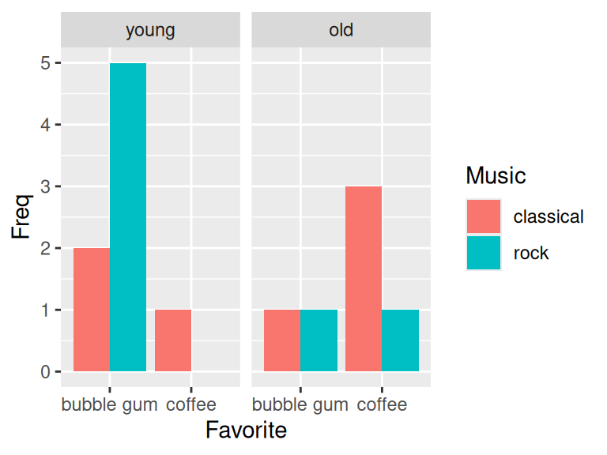

# Multidimensional categorical variables

In this chapter, we will focus on multivariate categorical data. Here, it is noteworthy that multivariate plot is not the same as multiple variable plot, where the former is used for analysis with multiple outcomes. 

## Barcharts

Bar chats are used to display the frequency of multidimensional categorical variables. In the next few plots you will be shown different kinds of bar charts.

### Stacked bar chart


```r
library(ggplot2)
library(dplyr)
library(tidyr)
cases <- read.csv("data/icecream.csv")
icecreamcolors <- c("#ff99ff", "#cc9966") # pink, coffee
ggplot(cases, aes(x = Age, fill = Favorite)) + 
    geom_bar() + scale_fill_manual(values = icecreamcolors)
```


### Grouped bar chart

Use ``position = "dodge"`` to create grouped bar chart


```r
ggplot(cases, aes(x = Age, fill = Favorite)) +
  geom_bar(position = "dodge") +
  scale_fill_manual(values = icecreamcolors)
```


### Grouped bar chart with facets


```r
ggplot(cases, aes(x = Age)) +
  geom_bar(position = "dodge") +
  facet_wrap(~Favorite)
```


### Grouped barchart with three categorical variables


```r
counts3 <- cases %>%
  group_by(Age, Favorite, Music) %>%
  summarize(Freq = n()) %>%
  ungroup() %>%
  complete(Age, Favorite, Music, fill = list(Freq = 0))

ggplot(counts3, aes(x = Favorite, y = Freq, fill = Music)) +
  geom_col(position = "dodge") +
  facet_wrap(~Age)
```



## Mosaic plots

Mosaic plots are used for visualizing data from two or more qualitative variables to show their proportions or associations.

