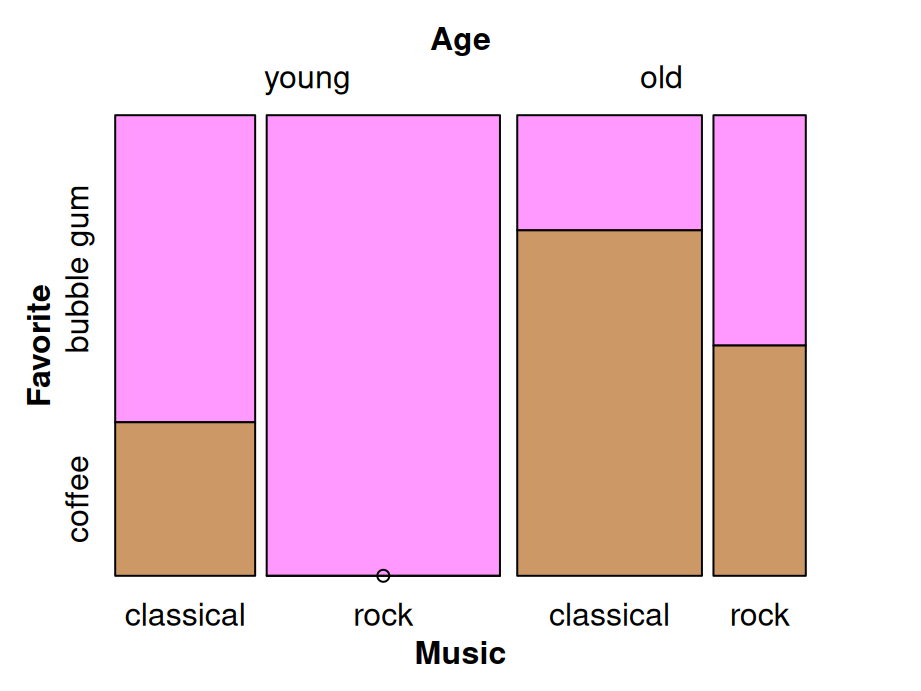

# Multidimensional categorical variables

In this chapter, we will focus on multivariate categorical data. Here, it is noteworthy that multivariate plot is not the same as multiple variable plot, where the former is used for analysis with multiple outcomes. 

## Barcharts

Bar chats are used to display the frequency of multidimensional categorical variables. In the next few plots you will be shown different kinds of bar charts.

### Stacked bar chart


```r
library(ggplot2)
library(dplyr)
library(tidyr)
cases <- read.csv("data/icecream.csv")
icecreamcolors <- c("#ff99ff", "#cc9966") # pink, coffee
ggplot(cases, aes(x = Age, fill = Favorite)) + 
    geom_bar() + scale_fill_manual(values = icecreamcolors)
```


### Grouped bar chart

Use ``position = "dodge"`` to create grouped bar chart


```r
ggplot(cases, aes(x = Age, fill = Favorite)) +
  geom_bar(position = "dodge") +
  scale_fill_manual(values = icecreamcolors)
```


### Grouped bar chart with facets


```r
ggplot(cases, aes(x = Age)) +
  geom_bar(position = "dodge") +
  facet_wrap(~Favorite)
```


### Grouped barchart with three categorical variables


```r
counts3 <- cases %>%
  group_by(Age, Favorite, Music) %>%
  summarize(Freq = n()) %>%
  ungroup() %>%
  complete(Age, Favorite, Music, fill = list(Freq = 0))

ggplot(counts3, aes(x = Favorite, y = Freq, fill = Music)) +
  geom_col(position = "dodge") +
  facet_wrap(~Age)
```


## Mosaic plots

Mosaic plots are used for visualizing data from two or more qualitative variables to show their proportions or associations.

### Mosaic plot with one variable


```r
library(grid)
icecream <- read.csv("data/MusicIcecream.csv")
icecreamcolors <- c("#ff99ff", "#cc9966") 
counts2 <- icecream %>%
  group_by(Age, Favorite) %>%
  summarize(Freq = sum(Freq))
vcd::mosaic(~Age, direction = "v", counts2)
```


### Mosaic plot with two variables


```r
vcd::mosaic(Favorite ~ Age, counts2, direction = c("v", "h"),
            highlighting_fill = icecreamcolors)
```


### Mosaic plot with three variables(Best practice)

Here's some criteria of best practice of mosaic plots :

>Dependent variables is split last and split horizontally
>
>Fill is set to dependent variable
>
>Other variables are split vertically
>
>Most important level of dependent variable is closest to the x-axis and darkest (or most noticable shade)
>


```r
vcd::mosaic(Favorite ~ Age + Music, counts3,
            direction = c("v", "v", "h"),
            highlighting_fill = icecreamcolors)
```


### Mosaic plots: spine plot

Spine plot is a mosaic plot with straight, parallel cuts in one dimension (“spines”) and only one variable cutting in the other direction.


```r
library(vcdExtra)
library(forcats)
foodorder <- Alligator %>% group_by(food) %>% summarize(Freq = sum(count)) %>% 
  arrange(Freq) %>% pull(food)
ally <- Alligator %>% 
  rename(Freq = count) %>% 
  mutate(size = fct_relevel(size, "small"),
         food = factor(food, levels = foodorder),
         food = fct_relevel(food, "other"))

vcd::mosaic(food ~ sex + size, ally,
       direction = c("v", "v", "h"),
       highlighting_fill= RColorBrewer::brewer.pal(5, "Accent"))
```


### Mosaic plot: tree map

Treemap is a filled rectangular plot representing hierarchical data (fill color does not necessarily represent frequency count)


```r
library(treemap)
data(GNI2014)
treemap::treemap(GNI2014,
       index=c("continent", "iso3"),
       vSize="population",
       vColor="GNI",
       type="value",
       format.legend = list(scientific = FALSE, big.mark = " "))
```


