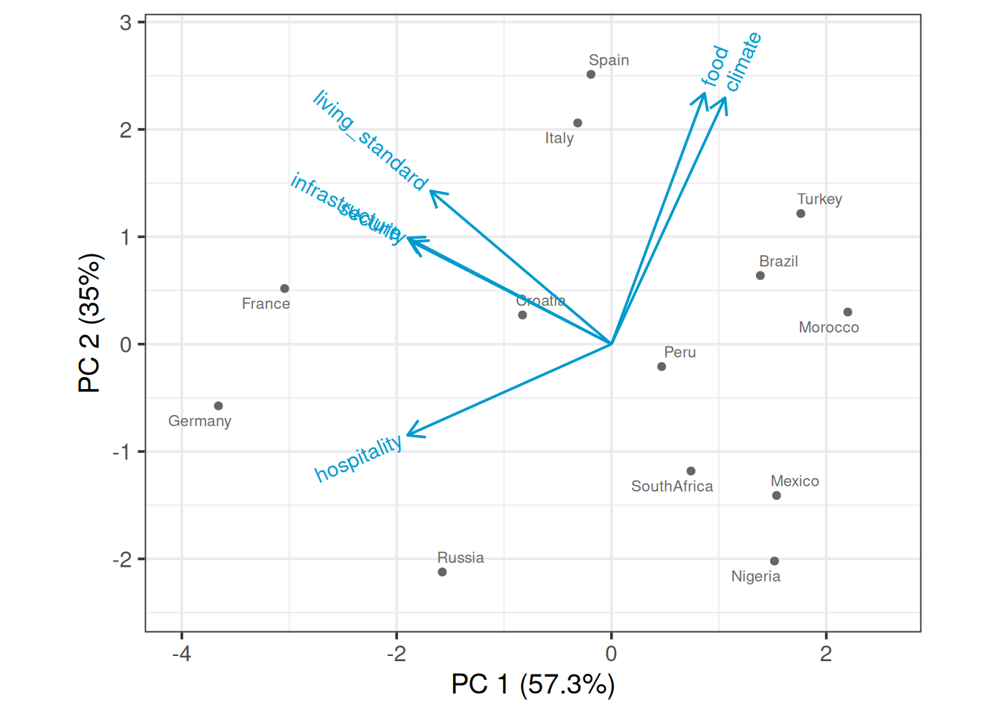

# Multidimensional continuous variables

In this chapter, we will look at techniques that explore the relationships between multiple continuous variables.

## Parallel coordinate plot

### Basics and implications

For the following example, we use the famous `iris` data set. After installing `GGally`, we use `ggparcoord` to create the plot simply by specifying the columns we want.

```r
library(GGally)

ggparcoord(iris, columns=1:4, 
           title = "Parallel coordinate plot for Iris flowers")
```


Generally, parallel coordinate plots are used to infer relationships between multiple continuous variables - we mostly use them to detect a general trend that our data follows, and also the specific cases that are outliers. 

Please keep in mind that parallel coordinate plots are not the ideal graph to use when there are just categorical variables involved. We can include a few categorical variables for the sake of clustering, but using a lot of categorical variables results in overlapping profiles, which makes it difficult to interpret.

### Modifications

The default parallel coordinate plot might be messy and hard to interpret. The following techniques will help to create better visuals and convey clearer trends.

#### Grouping

Generally, you use grouping when you want to observe a pattern by group of a categorical variable. To do this, we set groupColumn to the desired categorical variable.

#### Alpha

In practice, parallel coordinate plots are not going to be used for very small datasets. Your data will likely have thousands and thousands of cases, and sometimes it can get very difficult to observe anything when there are many overlaps. We set the alphaLines between zero and one, and it reduces the opacity of all lines. 

#### Scales

Sometimes the value in your variables have very different range and it is necessary to rescale them to make comparisons. By default, `ggparcoord` standardize your data. 

The following are some other scaling options:

1. **std**: default value, where it subtracts mean and divides by standard deviation.
2. **robust**: subtract median and divide by median absolute deviation.
3. **uniminmax**: scale all values so that the minimum is at 0 and maximum at 1.
4. **globalminmax**: no scaling, original values taken.

#### Splines

Generally, we use splines if we have a column where there are a lot of repeating values, which adds a lot of noise. The case lines become more and more curved when we set a higher spline factor, which removes noise and makes for easier observations of trends. It can be set using the splineFactor attribute. 

#### Reordering

You can reorder your columns in any way you want. Simply put the order in a vector. For example:

```
columns = c(1,3,4,2,5)
```

#### Application

Consider the following example, we apply grouping, alpha tuning, scaling and splines on the `iris` data set. Compare the two plot and the modified graph is noticeably easier to interpret.


```r
ggparcoord(iris, columns=1:4, groupColumn=5, alpha=0.5, scale='uniminmax',splineFactor=10,
           title = "Modified parallel coordinate plot for Iris flowers")
```


### Interactive parallel coordinate plot


Package `parcoords` can help us in creating interactive parallel coordinate plots. The following example is created using New York State crime data. 


```r
df_a %>% 
  select(-c("Year","Months Reported","Index Total","Violent Total","Property Total")) %>%
  arrange(df_a) %>%
  parcoords(rownames = FALSE,
            brushMode = "1D-axes",
            color = list(colorBy = "Region",
                         colorScale = "scaleOrdinal",
                         colorScheme = "schemeCategory10"),
            alpha = 0.5,
            withD3 = TRUE,
            width = 770,
            height = 600)
```

```{=html}
<div class="parcoords html-widget" height="600" id="htmlwidget-472a836849534b4229ae" style="width:770px;height:600px; position:relative; overflow-x:auto; overflow-y:hidden; max-width:100%;" width="770"></div>
<script type="application/json" data-for="htmlwidget-472a836849534b4229ae">{"x":{"data":{"names":["1","2","3","4","5","6","7","8","9","10","11","12","13","14","15","16","17","18","19","20","21","22","23","24","25","26","27","28","29","30","31","32","33","34","35","36","37","38","39","40","41","42","43","44","45","46","47","48","49","50","51","52","53","54","55","56","57","58","59","60","61","62"],"County":["Albany","Allegany","Bronx","Broome","Cattaraugus","Cayuga","Chautauqua","Chemung","Chenango","Clinton","Columbia","Cortland","Delaware","Dutchess","Erie","Essex","Franklin","Fulton","Genesee","Greene","Hamilton","Herkimer","Jefferson","Kings","Lewis","Livingston","Madison","Monroe","Montgomery","Nassau","New York","Niagara","Oneida","Onondaga","Ontario","Orange","Orleans","Oswego","Otsego","Putnam","Queens","Rensselaer","Richmond","Rockland","Saratoga","Schenectady","Schoharie","Schuyler","Seneca","St Lawrence","Steuben","Suffolk","Sullivan","Tioga","Tompkins","Ulster","Warren","Washington","Wayne","Westchester","Wyoming","Yates"],"Region":["Non-NYC","Non-NYC","NYC","Non-NYC","Non-NYC","Non-NYC","Non-NYC","Non-NYC","Non-NYC","Non-NYC","Non-NYC","Non-NYC","Non-NYC","Non-NYC","Non-NYC","Non-NYC","Non-NYC","Non-NYC","Non-NYC","Non-NYC","Non-NYC","Non-NYC","Non-NYC","NYC","Non-NYC","Non-NYC","Non-NYC","Non-NYC","Non-NYC","Non-NYC","NYC","Non-NYC","Non-NYC","Non-NYC","Non-NYC","Non-NYC","Non-NYC","Non-NYC","Non-NYC","Non-NYC","NYC","Non-NYC","NYC","Non-NYC","Non-NYC","Non-NYC","Non-NYC","Non-NYC","Non-NYC","Non-NYC","Non-NYC","Non-NYC","Non-NYC","Non-NYC","Non-NYC","Non-NYC","Non-NYC","Non-NYC","Non-NYC","Non-NYC","Non-NYC","Non-NYC"],"Murder":[38,6,111,10,2,4,2,4,2,2,2,2,2,16,138,0,0,2,0,0,0,2,6,175,0,0,4,100,2,46,84,26,26,64,4,18,0,0,0,0,78,24,20,18,6,10,0,0,2,2,6,66,8,0,0,12,0,0,2,48,0,2],"Rape":[218,76,523,252,74,126,164,64,104,118,54,80,58,186,356,66,62,62,68,50,8,80,148,701,26,56,82,436,22,108,430,194,222,362,146,260,40,158,60,18,515,136,84,100,156,82,24,8,54,98,112,342,90,38,94,128,100,92,120,224,36,16],"Robbery":[426,6,3519,156,12,32,66,56,14,6,22,10,2,168,1812,10,14,22,30,4,0,14,44,3816,0,10,20,1052,22,1046,3053,282,182,566,24,228,14,42,14,4,2549,178,245,114,34,214,8,4,2,14,12,630,34,4,76,48,4,8,36,790,4,2],"Aggravated Assault":[1548,58,8976,902,162,236,552,220,106,130,110,102,74,764,5036,44,80,140,108,330,6,116,358,9898,20,38,162,2856,88,2452,5697,804,682,2246,162,828,72,190,76,52,6487,572,998,448,242,806,54,8,52,158,104,1598,160,76,166,256,50,58,182,2108,50,12],"Burglary":[1416,172,2230,1336,274,290,1080,262,292,246,188,258,192,474,5362,98,230,280,196,114,14,254,514,4099,82,142,242,4194,176,1950,4449,1134,966,2984,374,862,162,476,160,86,2842,794,286,440,512,792,62,18,58,322,328,2248,250,142,462,366,158,94,334,1634,72,48],"Larceny":[10338,428,18728,7268,1104,1614,3826,2266,1002,1724,1022,1238,554,5492,26768,386,852,1338,1152,576,58,1288,2902,29306,144,858,1334,19038,1152,17468,32568,6310,6410,11888,2232,7044,580,2506,916,578,22431,4322,3163,4144,3332,5264,458,60,676,1618,1072,28824,1082,562,3370,2770,1138,404,1890,14326,428,358],"Motor Vehicle Theft":[840,56,2130,436,108,112,152,134,50,52,48,34,38,292,3910,20,54,72,90,24,6,46,136,2943,16,28,64,2616,60,1404,1395,738,416,1856,86,396,54,226,48,58,2544,342,246,206,144,490,24,0,32,42,92,2528,70,38,84,138,28,44,100,1482,18,4]},"options":{"rownames":false,"color":{"colorBy":"Region","colorScale":"scaleOrdinal","colorScheme":"schemeCategory10"},"brushMode":"1D-axes","brushPredicate":"AND","reorderable":false,"margin":{"top":50,"bottom":50,"left":100,"right":50},"alpha":0.5,"mode":false,"bundlingStrength":0.5,"smoothness":0,"width":770,"height":600},"autoresize":false,"tasks":null},"evals":[],"jsHooks":[]}</script>
```

In the interactive graph, for each feature, you can create a square box to filter for observations. For example, you can look at a certain county, or you can filter for all counties that are in New York City (Region=NYC). Overall, the interactive plot is more flexible for analysis.

### External resource

Just like a static graph, there is a lot of things you can change in the interactive setting. Refer [R documentation](https://www.rdocumentation.org/packages/parcoords/versions/1.0.0/topics/parcoords) for more options. Unfortunately, the original develop blog of the library is unreachable currently.

<br>

## Biplot

In the following chapter, we will introduce biplot. We will talk briefly on how to create a biplot and how to interpret it.

### Principal components analysis (PCA)

We first introduce PCA as the existence of biplot is built up on it. Given a data set with multiple variables, the goal of PCA is to reduce dimensionality by finding a few linear combinations of the variables that capture most of the variance. Consider the following example using rating of countries. 


As a common technique, we first standardize each variable to have mean of 0 and variance of 1 


```r
scaled_ratings <- ratings %>% 
  mutate(across(where(is.numeric), ~round((.x-mean(.x))/sd(.x), 2)))
scaled_ratings
```

```
## # A tibble: 13 × 7
##    country     living_standard climate  food security hospitality infrastructure
##    <chr>                 <dbl>   <dbl> <dbl>    <dbl>       <dbl>          <dbl>
##  1 Italy                  0.9     1.04  1.2       0.5       -0.34           0.83
##  2 Spain                  0.9     1.49  1.2       0.5       -0.74           1.23
##  3 Croatia               -0.12    0.14 -0.03      1          0.47           0.43
##  4 Brazil                -0.12    1.04  0.38     -0.5       -0.74          -0.77
##  5 Russia                 0.39   -1.67 -1.68     -0.5        1.27           0.43
##  6 Germany                1.41   -1.22 -1.68      2          1.27           1.63
##  7 Turkey                -0.12    1.04  1.2      -0.5       -1.15          -0.77
##  8 Morocco               -0.63    0.59  0.79     -1         -1.15          -1.17
##  9 Peru                  -0.12    0.14 -0.03     -0.5        0.06          -0.37
## 10 Nigeria               -1.64   -0.76 -0.85     -1         -0.34          -1.17
## 11 France                 1.41   -0.76  0.38      1.5        2.08           1.23
## 12 Mexico                -1.64   -0.31 -0.44     -1         -0.34          -0.77
## 13 SouthAfrica           -0.63   -0.76 -0.44     -0.5       -0.34          -0.77
```

To apply PCA, we use function `prcomp()`. `summary()` will then be used to show result.


```r
pca <- prcomp(ratings[,2:7], scale. = TRUE)
summary(pca)
```

```
## Importance of components:
##                          PC1    PC2     PC3     PC4     PC5     PC6
## Standard deviation     1.854 1.4497 0.43959 0.39052 0.27517 0.19778
## Proportion of Variance 0.573 0.3503 0.03221 0.02542 0.01262 0.00652
## Cumulative Proportion  0.573 0.9232 0.95544 0.98086 0.99348 1.00000
```

As we can see that the first two principal components capture 92.3% of the total variance.


```r
mat_round <- function(matrix, n = 3) apply(matrix, 2, function(x) round(x, n))

mat_round(pca$rotation)
```

```
##                    PC1    PC2    PC3    PC4    PC5    PC6
## living_standard -0.429  0.364  0.112 -0.673  0.466 -0.028
## climate          0.270  0.585 -0.210  0.036 -0.149 -0.719
## food             0.221  0.596  0.610  0.212 -0.077  0.417
## security        -0.475  0.244 -0.282  0.676  0.419  0.049
## hospitality     -0.484 -0.216  0.636  0.170 -0.213 -0.490
## infrastructure  -0.484  0.252 -0.297 -0.121 -0.731  0.256
```

We are also able to see the specific linear combination of variables for each principal component.

### Draw a biplot

To draw a biplot, we suggest using `draw_biplot` from `redav` package. You can install the package using `remotes::install_github("jtr13/redav")`. Note that the function will apply PCA and draw the plot.


```r
library(redav)
draw_biplot(ratings,arrows=FALSE)
```


The above biplot is set to be without arrows. We can rougly identify clusters from the graph. By running some clustering algorithm like `k-means`, you will be able to see it clearer.


```r
scores <- pca$x[,1:2]
k <- kmeans(scores, centers = 6)
scores <- data.frame(scores) %>%
  mutate(cluster = factor(k$cluster), country = ratings$country)
g4 <- ggplot(scores, aes(PC1, PC2, color = cluster, label = country)) +
  geom_point() +
  geom_text(nudge_y = .2) +
  guides(color="none")
g4
```


Now for a standard bibplot:


```r
draw_biplot(ratings)
```



To interpret the graph, you could imagine a perpendicular line from a certain point(country) to a feature arrow you are concerned. The further the intersection is on the arrow line, the higher the score. Take Spain for example, it has high score on all variables except hospitality as the imaginary line would land on the negative axis. 

You can also add calibrated axis, which will help you better compare a certain variable among countries.


```r
draw_biplot(ratings,"living_standard")
```


You see in this case, a projection line is added. We can clearly see that France has the highest living standard rating and Nigeria has the lowest raiting.
