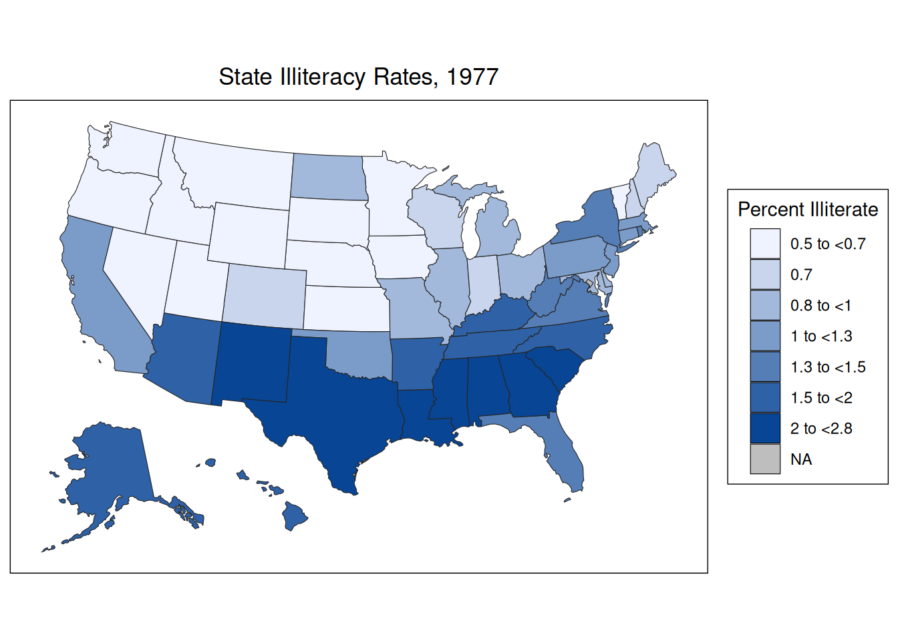
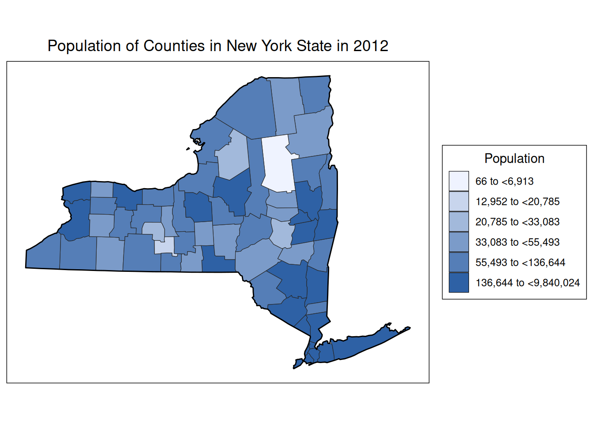
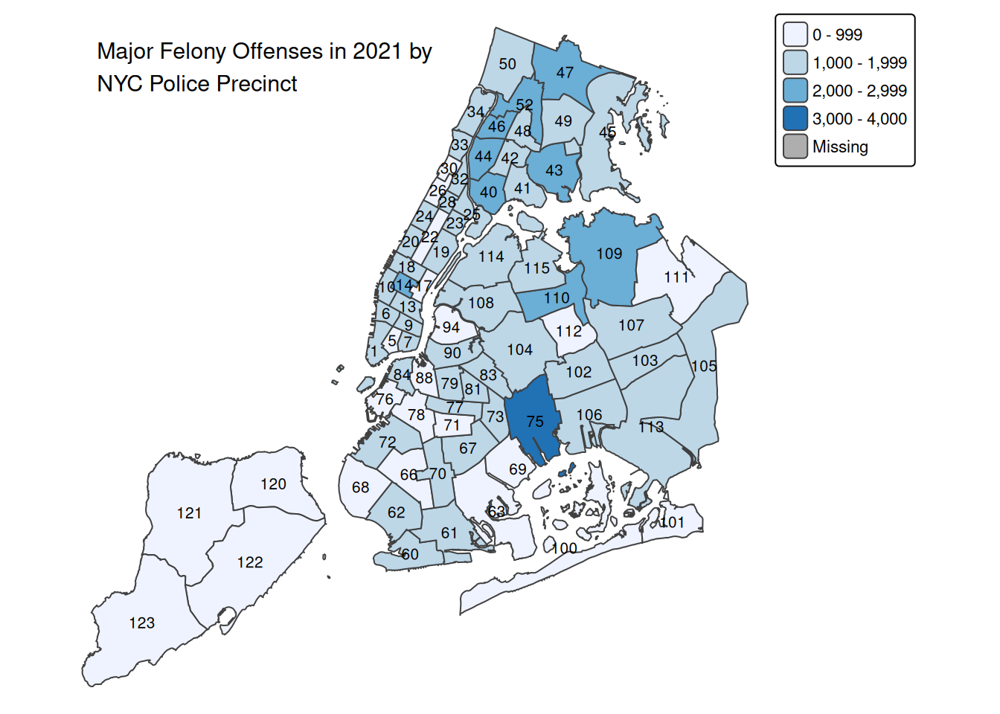

# Spatial data

The page is currently being updated, check back later.

## Introduction 
In this chapter, we will take a glimpse into spatial analysis using R. There are an overwhelming number of R packages for analyzing and visualizing spatial data. In broad terms, spatial visualizations require a merging of non-spatial and spatial information. For example, if you wish to create a choropleth map of the murder rate by county in New York State, you need county level data on murder rates, and you also need geographic data for drawing the county boundaries, stored in what are called shape files. 

A rough divide exists between packages that don’t require you deal with shape files and those that do. The former work by taking care of the geographic data under the hood: you supply the data with a column for the location and the package takes care of figuring out how to draw those locations. 


## Packages

### `choroplethr`

Choropleth maps use color to indicate the value of a variable within a defined region, generally political boundaries. `choroplethr` is capable of drawing state and county level maps without using shape files.

Consider the following example using `state.x77` showing the percentage of illiterate in each states. Note the process of data transformation, you need to exactly have a column named 'region' with the state names and a column named 'value'.


```r
library(dplyr)
library(tidyr)
library(tibble)
library(ggplot2)
library(choroplethr)

# data frame must contain "region" and "value" columns

df_illiteracy <- state.x77 %>% as.data.frame() %>% 
  rownames_to_column("state") %>% 
  transmute(region = tolower(`state`), value = Illiteracy)

state_choropleth(df_illiteracy,
                 title = "State Illiteracy Rates, 1977",
                 legend = "Percent Illiterate")
```



Plotting at county level is also possible. In the following example we show the population of counties in New York state in 2012.


```r
library(choroplethrMaps)
data(county.regions)
data(df_pop_county) 

ny_county_fips = county.regions %>%
  filter(state.name == "new york") %>%
  select(region)

county_choropleth(df_pop_county, 
                  title = "Population of Counties in New York State in 2012",
                  legend = "Population",
                  county_zoom = ny_county_fips$region)
```



We use `county_choropleth` to create a U.S map at county level and zoom into New York state. Note that `county_zoom` takes in fips codes of counties. For more reference, visit the [R documentation page](https://www.rdocumentation.org/packages/choroplethr/versions/3.7.0).


### `ggmap`

`ggmap` is a great package to generate real-world maps. Moreover, it is compatible with `ggplot2` allowing you to easily add layers on top of the base map. There are two options in generating maps and we demonstrate one using stamenmap.


```r
library(ggmap)

ny_map <- get_stamenmap(bbox = c(left = -74.2591, bottom = 40.4774, 
                                 right = -73.7002, top = 40.9162),
                        zoom = 10, maptype = "toner-lite")

ggmap(ny_map) +
  geom_point(aes(x=-73.9857,y=40.7484),size=0.8,color='blue') 
```


A map of New York City is created, and you will see a blue point representing Empire State Building. You can very simply add points using `geom_point` as long as you have the coordinates for the points. However, one clear drawback using stamenmap is that the map resolution is not satisfying and you will eventually find that the smaller zoom value creates blurry maps.

For this reason, we encourage readers to try the option using Google maps. You will need to set up a Google Cloud account (requires credit card). After enabling the Google map APIs, register you API keys with `ggmap` using `register_google(key = "[your key]")` and you are all set. Now take a look at the an example using Google map API

```
ggmap(get_googlemap(center = c(lon = -74.006, lat = 40.7128),zoom = 14))
```

<center>
{width=70%}
</center>

You will see the map is at great resolution regardless of how you zoom in. For demonstration purpose, we provided a image of the map derived by running the code. For more details regarding the package usage, you can refer at [ggmap GitHub page](https://github.com/dkahle/ggmap).


## Shape file

There are cases such that no existing packages can directly create your desired map. For example, what if we want to create a map of highways in New York State. In such case, we will resort to shape files. In the following example, we use the shape file of police precinct in New York City.

### `sf`

We use `sf` library to read in shape files. One of the first thing to remember is that one shape file contains a set of files and all of them required for the shape file to run properly. However, when reading the file, we only need to use the one ending with `.shp`. For example


```r
library(sf)
ny_police = st_read('nyc_police/nypp.shp',quiet=TRUE) %>%
  mutate(Precinct = as.character(Precinct))

head(ny_police)
```

```
## Simple feature collection with 6 features and 3 fields
## Geometry type: MULTIPOLYGON
## Dimension:     XY
## Bounding box:  xmin: 971013.5 ymin: 188082.3 xmax: 992119.1 ymax: 217541.3
## Projected CRS: NAD83 / New York Long Island (ftUS)
##   Precinct Shape_Leng Shape_Area                       geometry
## 1        1   81117.86   47300568 MULTIPOLYGON (((972081.8 19...
## 2        5   18807.12   18094527 MULTIPOLYGON (((987399.2 20...
## 3        6   26413.24   22103327 MULTIPOLYGON (((984337.5 20...
## 4        7   17288.06   18365996 MULTIPOLYGON (((991608.6 20...
## 5        9   19773.00   21395839 MULTIPOLYGON (((992119.1 20...
## 6       10   40281.97   27266581 MULTIPOLYGON (((983866 2172...
```

You can see that the object looks like a data set, except with a long column called geometry. The geometry column contains spatial information and is the key to map generation.

To simply see the shape, we can use `st_geometry()` to extract spatial information and feed into `plot()`


```r
plot(st_geometry(ny_police))
```


We get a map of New York City divided by police precinct. Note that if you directly feed in `ny_police` into `plot()`, you will get mulitiply maps drawn from each column. It might not create you desired maps and when you are dealing with large shape files, it will be extremely slow.

### `tmap`

Only generating the map is not particularly meaningful. We want to combine data with the map to convey some meaningful findings. Since we are using police precinct, it is only natural to use crime data.


```r
library(readxl)
library(tmap)

ny_crime <- read_xls('data/felony.xls', skip = 1) %>% 
  rename(Precinct = PCT, Crime = CRIME) %>% 
  fill(Precinct) %>% 
  filter(Crime == "TOTAL SEVEN MAJOR FELONY OFFENSES")

ny_crime <- left_join(ny_police, ny_crime)
```

We read in the felony data for nyc in 2021 and joined it with the `sf` object. Then, we create map using `tmap` package. Notice that in `tm_polygons()`, we specify the column to be `2021`.


```r
ny_crime %>% 
  tm_shape() + 
  tm_polygons("2021", palette = "Blues", title="") + 
  tm_text("Precinct", size = .65) +
  tm_layout("Major Felony Offenses in 2021 by\nNYC Police Precinct",
            title.size = .95, frame = FALSE)
```



For more usage, you can refer at [tmap:get started!](https://cran.r-project.org/web/packages/tmap/vignettes/tmap-getstarted.html)

