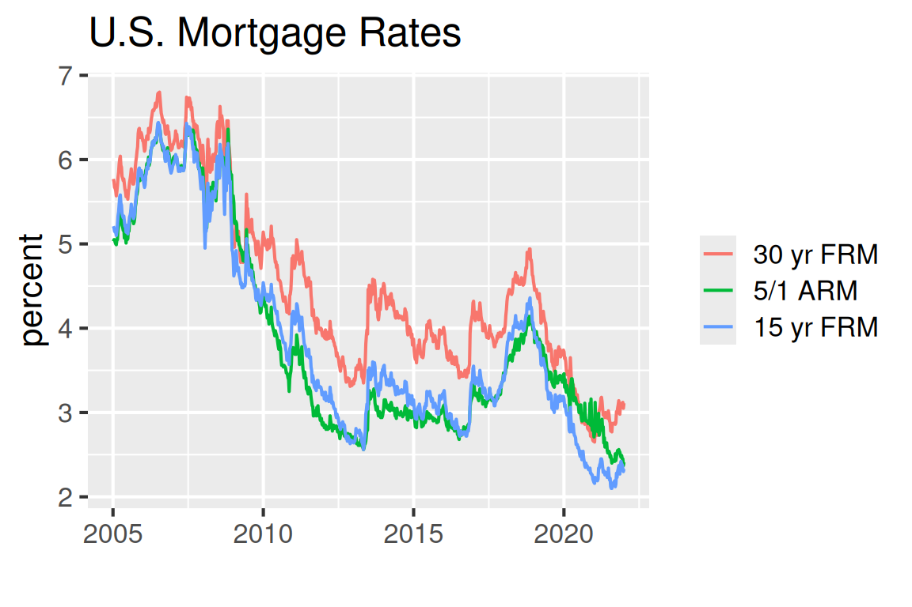
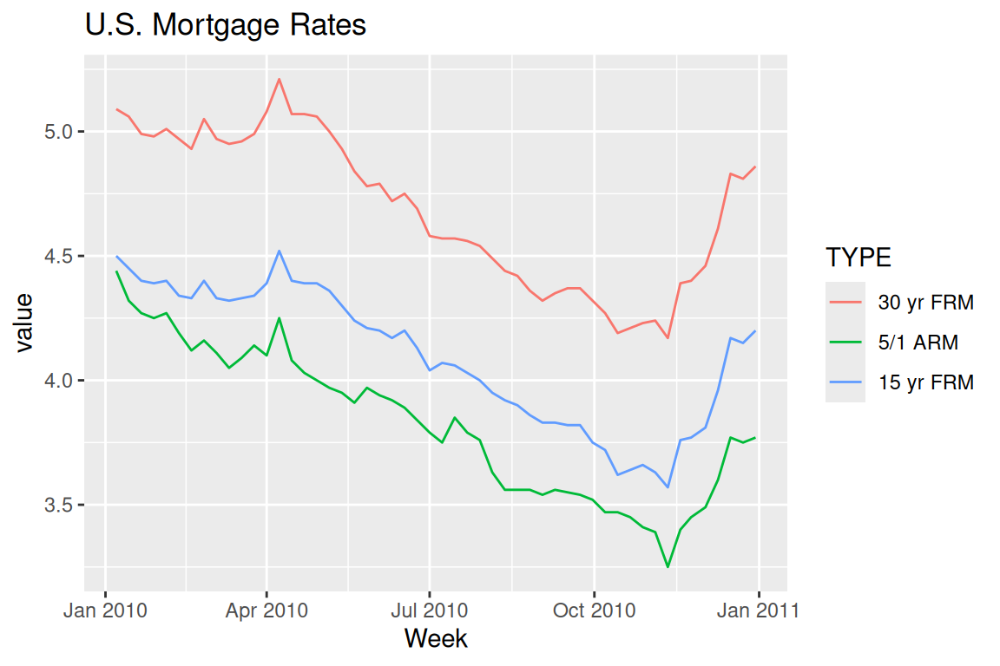
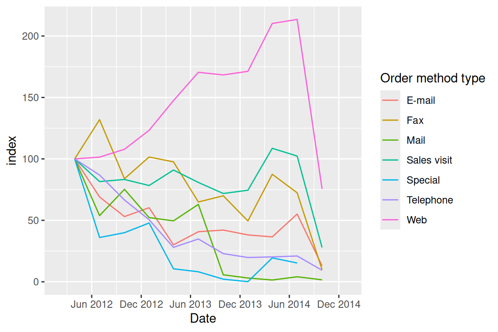

# Time series

Time series, by definition, is a sequence of data point collected over a certain period of time. In this chapter, we will demonstrate several useful ways of plotting time-series data and how to processing ``date`` data type in R.


## Dates

Since time series analysis looks into how data is changing over time, the very first step is to transform the data into correct format.

### Basic R functions

You can convert character data to ``Date`` class with ``as.Date()``:


```r
dchar <- "2018-10-12"
ddate <- as.Date(dchar)
class(dchar)
```

```
## [1] "character"
```

```r
class(ddate)
```

```
## [1] "Date"
```
You can also specifying the format by:


```r
as.Date("Thursday, January 6, 2005", format = "%A, %B %d, %Y")
```

```
## [1] "2005-01-06"
```
For a list of the conversion specifications available in R, see ``?strptime``.

Here is a list of the conversion specifications for date format from [this post](https://michaeltoth.me/the-ultimate-opinionated-guide-to-base-r-date-format-functions.html)

<center>
{width=75%}
</center>

Also, ``Date`` class supports calculation between dates:


```r
as.Date("2017-11-02") - as.Date("2017-01-01")
```

```
## Time difference of 305 days
```

```r
as.Date("2017-11-12") > as.Date("2017-3-3")
```

```
## [1] TRUE
```
### Lubridate

The tidyverse ``lubridate`` makes it easy to convert dates that are not in standard format with ``ymd()``, ``ydm()``, ``mdy()``, ``myd()``, ``dmy()``, and ``dym()`` (among many other useful date-time functions):


```r
lubridate::mdy("April 13, 1907")
```

```
## [1] "1907-04-13"
```

The ``lubridate`` package also provides additional functions to extract information from a date:


```r
today <- Sys.Date()
lubridate::year(today)
```

```
## [1] 2022
```

```r
lubridate::yday(today)
```

```
## [1] 250
```

```r
lubridate::month(today, label = TRUE)
```

```
## [1] Sep
## 12 Levels: Jan < Feb < Mar < Apr < May < Jun < Jul < Aug < Sep < ... < Dec
```

```r
lubridate::week(today)
```

```
## [1] 36
```

## Time series

For time-series data-sets, line plots are mostly used with time on the x-axis. Both base R graphics and ``ggplot2`` “know” how to work with a Date class variable, and label the axes properly:


The data comes from the official [website](https://www.freddiemac.com/pmms).


```r
library(dplyr)
library(readxl)
library(tidyr)
library(ggplot2)
df <- read_excel("data/historicalweeklydata.xls", 
    col_types = c("date", "numeric", "numeric", 
        "numeric"))

plot(df$Week, df$`30 yr FRM`, type = "l") # on the order of years
```


```r
g<-ggplot(df %>% filter(Week < as.Date("2006-01-01")), 
       aes(Week, `30 yr FRM`)) + 
  geom_line() + 
  theme_grey(14)
g
```


We can control the x-axis breaks, limits, and labels with ``scale_x_date()``, and use ``geom_vline()`` with ``annotate()`` to mark specific events in a time series.


## Multiple time series

The following plot shows a multiple time series of U.S. Mortgage rates. 


```r
df2 <- df %>% pivot_longer(cols = -c("Week"), names_to = "TYPE") %>%
  mutate(TYPE = forcats::fct_reorder2(TYPE, Week, value))# puts legend in correct order

ggplot(df2, aes(Week, value, color = TYPE)) +
  geom_line() +
  ggtitle("U.S. Mortgage Rates") +  labs (x = "", y = "percent") +
  theme_grey(16) +
  theme(legend.title = element_blank())
```



To plot the time series in a specific period of time, use ``filter()`` before ``ggplot``:


```r
library(lubridate)
df2010 <- df2 %>% filter(year(Week) == 2010)
ggplot(df2010, aes(Week, value, color = TYPE)) +
  geom_line() +
  ggtitle("U.S. Mortgage Rates")
```




## Time series patterns

Next, as an important part of time series analysis, we want to find the existing patterns of the data.
We first starting from plotting the overall long-term trend:


```r
library (readr)
urlfile="https://raw.githubusercontent.com/jtr13/data/master/ManchesterByTheSea.csv"
data<-read_csv(url(urlfile))

g <- ggplot(data, aes(Date, Gross)) +
  geom_line() +
  ggtitle("Manchester by the Sea", "Daily Gross (US$), United States") +
  xlab("2016-2017")
g
```


Adding a smoother to the data, adjusting the smoothing parameter ``span =`` to find a proper smoother which is not overfitting/underfitting:


```r
g <- ggplot(data, aes(Date, Gross)) + geom_point()
g + geom_smooth(method = "loess", span = .5, se = FALSE)
```


Mark the pattern by high-lighting the data on very Saturday:


```r
g <- ggplot(data, aes(Date, Gross)) +
  geom_line() +
  ggtitle("Manchester by the Sea", "Daily Gross, United States")
saturday <- data %>% filter(wday(Date) == 7) 
g +
  geom_point(data = saturday, aes(Date, Gross), color = "deeppink")
```


Another way is to use facet to show the cyclical pattern:


```r
ggplot(data, aes(Date, Gross)) +  
    geom_line(color = "grey30") + geom_point(size = 1) +  
    facet_grid(.~wday(Date, label = TRUE)) +  
    geom_smooth(se = FALSE)
```


Also, basic R can plot the decomposed time series automatically. This method is used to study the trend, seasonal effect on data with at least 2 periods. For additive components, use ``type = "additive"``.


```r
tsData <- EuStockMarkets[, 2]
decomposedRes <- decompose(tsData, type="mul")
plot (decomposedRes)
```


## Index

When making comparisons on multi-line plots, index is a way of scaling the data: Each value is divided by the first value for that group and multiplied by 100. 


```r
urlfile="https://raw.githubusercontent.com/jtr13/data/master/WA_Sales_Products_2012-14.csv"
sale<-read_csv(url(urlfile))

sale$Q <- as.numeric(substr(sale$Quarter, 2, 2))  
# convert Q to end-of-quarter date 
sale$Date <- as.Date(paste0(sale$Year, "-",as.character(sale$Q*3),"-30")) 

Methoddata <- sale %>%
  mutate(Revenue = Revenue/1000000) %>%
  group_by(Date,`Order method type`) %>%
  summarize(Revenue = sum(Revenue))  %>%
  ungroup() %>%
  group_by(`Order method type`) %>%
  mutate(index = round(100*Revenue/Revenue[1], 2)) %>%
  ungroup()
  
g <- ggplot(Methoddata, aes(Date, index,color = `Order method type`)) +
  geom_line(aes(group = `Order method type`)) +
  scale_x_date(limits = c(as.Date("2012-02-01"), as.Date("2014-12-31")), date_breaks = "6 months", date_labels = "%b %Y")
g
```




