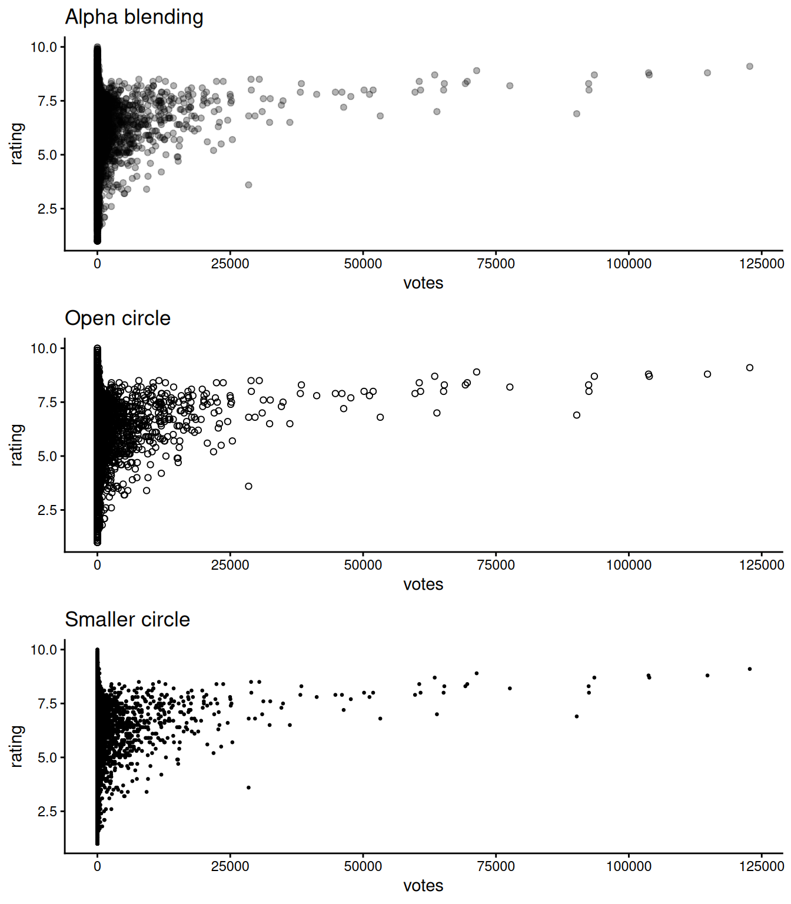
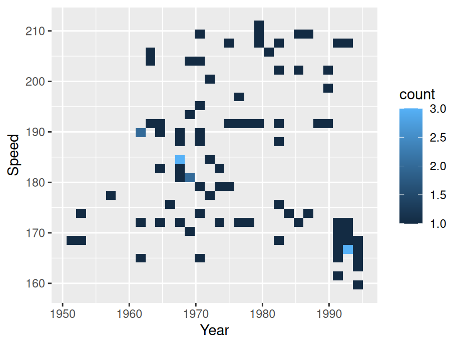

# Two continuous variables

In this chapter, we will look at techniques that explore the relationships between two continuous variables.

## Scatterplot

### Basics and implications

For the following example, we use data set `SpeedSki`. 


```r
library(GDAdata)
library(ggplot2)

ggplot(SpeedSki, aes(Year, Speed)) + 
  geom_point() +
  labs(x = "Birth year", y = "Speed achieved (km/hr)") +
  ggtitle("Skiers by birth year and speed achieved")
```


In our example, we simply use `geom_point` on variables `Year` and `Speed` to create the scatterplot. we try to capture if there is a relationship between the age of a player and the speed he/she can achieve. From the graph, it seems such relationship does not exist. Overall, scatterplots are very useful in understanding the correlation (or lack thereof) between variables. The scatterplot gives a good idea of whether that relationship is positive or negative and if there’s a correlation. However, don’t mistake correlation in a scatterplot for causation!

### Overplotting

In some situations a scatter plot faces the problem of overplotting as there are so many points overlapping. Consider the following example from class. To save time, we randomly sample 20% of the data in advance.


```r
library(dplyr)
library(ggplot2movies)

sample <- slice_sample(movies, prop = 0.2)

ggplot(sample,aes(x=votes,y=rating)) +
  geom_point() +
  ggtitle("Votes vs. rating") +
  theme_classic()
```


To create better visuals, we can use:

* Alpha blending - `alpha=...`

* Open circles - `pch=21`

* smaller circles - `size=...` or `shape="."`


```r
library(gridExtra)

f1 <- ggplot(sample,aes(x=votes,y=rating)) +
  geom_point(alpha=0.3) +
  theme_classic() +
  ggtitle("Alpha blending")

f2 <- ggplot(sample,aes(x=votes,y=rating)) +
  geom_point(pch = 21) +
  theme_classic() +
  ggtitle("Open circle")

f3 <- ggplot(sample,aes(x=votes,y=rating)) +
  geom_point(size=0.5) +
  theme_classic() +
  ggtitle("Smaller circle")

grid.arrange(f1, f2, f3,nrow = 3)
```



Other methods that directly deal with the data:

* Randomly sample data - as shown in the first code chunk using `sample_n`

* Subset - split data into bins using `ntile(votes, 10)`

* Remove outliers 

* Transform to log scale

### Interactive scatterplot

You can create an interactive scatterplot using `plotly`. In the following example, we take 1% of the movie data set to present a better visual. We plotted the votes vs. rating and grouped by the year they are released. In this graph:

* You can hover on to the points to see the title of the movie

* You can double click on the year legend to look at a certain year

* You can zoom into a certain part of the graph to better understand the data points.


```r
library(plotly)

sample2 <- slice_sample(movies,prop=0.01) %>%
  filter(year > 2000)

plot_ly(sample2, x = ~votes, y = ~rating,
        color = ~as.factor(year), text= ~title,
        hoverinfo = 'text') 
```

```{=html}
<div class="plotly html-widget html-fill-item-overflow-hidden html-fill-item" id="htmlwidget-0cb3fe02ee6aeea0150a" style="width:576px;height:432px;"></div>
<script type="application/json" data-for="htmlwidget-0cb3fe02ee6aeea0150a">{"x":{"visdat":{"218620f3b9b2":["function () ","plotlyVisDat"]},"cur_data":"218620f3b9b2","attrs":{"218620f3b9b2":{"x":{},"y":{},"text":{},"hoverinfo":"text","color":{},"alpha_stroke":1,"sizes":[10,100],"spans":[1,20]}},"layout":{"margin":{"b":40,"l":60,"t":25,"r":10},"xaxis":{"domain":[0,1],"automargin":true,"title":"votes"},"yaxis":{"domain":[0,1],"automargin":true,"title":"rating"},"hovermode":"closest","showlegend":true},"source":"A","config":{"modeBarButtonsToAdd":["hoverclosest","hovercompare"],"showSendToCloud":false},"data":[{"x":[143,8,117,7,202,68,879,11,153,94,201,63,48,89,687,5,8,18,53,179,237,62,42,7],"y":[7.0999999999999996,8.3000000000000007,5.5999999999999996,7.0999999999999996,5.2999999999999998,5.7000000000000002,7.2000000000000002,8.0999999999999996,6,7.5999999999999996,5.2000000000000002,5.7999999999999998,6.4000000000000004,5,5.7999999999999998,5.7999999999999998,4.5,3.1000000000000001,7,3.5,7.2000000000000002,7.0999999999999996,6.7999999999999998,6.4000000000000004],"text":["Wie Feuer und Flamme","Ghosts of Attica","Karmina 2","Antipoden","Un jeu d'enfants","I Love You Baby","Lammbock","Suor Sorriso","On the Nose","Scheinheiligen, Die","Bride of the Wind","Ball in the House","Gau lung bing sat","You're Killing Me...","Shura Yukihime","Gott ist ein toter Fisch","Luk siu fung","Nachtfalter","Dodgeball","Flying Virus","Jan Dara","Segundo aire, El","BigLove","Kewaishi"],"hoverinfo":["text","text","text","text","text","text","text","text","text","text","text","text","text","text","text","text","text","text","text","text","text","text","text","text"],"type":"scatter","mode":"markers","name":"2001","marker":{"color":"rgba(102,194,165,1)","line":{"color":"rgba(102,194,165,1)"}},"textfont":{"color":"rgba(102,194,165,1)"},"error_y":{"color":"rgba(102,194,165,1)"},"error_x":{"color":"rgba(102,194,165,1)"},"line":{"color":"rgba(102,194,165,1)"},"xaxis":"x","yaxis":"y","frame":null},{"x":[14,13,5,128,13,1264,5,381,106,597,54,227,5,5,19,8,291,10,292,7185,104,1466,20],"y":[5.7000000000000002,6.7999999999999998,7,5.5,6.5999999999999996,6.9000000000000004,9.4000000000000004,7.2999999999999998,6.4000000000000004,5.5999999999999996,7.0999999999999996,4.7000000000000002,8.1999999999999993,3.8999999999999999,6.7000000000000002,6.7000000000000002,4.2999999999999998,6.4000000000000004,2.3999999999999999,7.2999999999999998,5.2999999999999998,7.7999999999999998,7.5999999999999996],"text":["Seres humanos","Yard Sale, The","Cinedictum","Last Great Wilderness, The","Various Positions","11'09''01 - September 11","2wks, 1yr","2LDK","Edge of Madness","Garage Days","Original Latin Kings of Comedy, The","Livet i 8 bitar","Joyful Partaking","Sea and Stars","For Caroline","Trop petit prince, Le","Super Sucker","Lulu","Shark Attack 3: Megalodon","Narc","Merci Docteur Rey","Lunes al sol, Los","Lyckantropen"],"hoverinfo":["text","text","text","text","text","text","text","text","text","text","text","text","text","text","text","text","text","text","text","text","text","text","text"],"type":"scatter","mode":"markers","name":"2002","marker":{"color":"rgba(252,141,98,1)","line":{"color":"rgba(252,141,98,1)"}},"textfont":{"color":"rgba(252,141,98,1)"},"error_y":{"color":"rgba(252,141,98,1)"},"error_x":{"color":"rgba(252,141,98,1)"},"line":{"color":"rgba(252,141,98,1)"},"xaxis":"x","yaxis":"y","frame":null},{"x":[13,1580,7,11,137,73,11,22,20642,8,2417,9,12,34,21],"y":[6.0999999999999996,4,8.3000000000000007,7.9000000000000004,5.5,2.1000000000000001,5.2999999999999998,5.0999999999999996,5.7000000000000002,7,5.4000000000000004,6.7999999999999998,8.1999999999999993,7.2000000000000002,4.5],"text":["Misa mi","Biker Boyz","Hk","Starkiss - Circusmeisjes in India","Stealing Sinatra","Technical Writer, The","Sweetheart","Fascist of X-Mart, The","Daredevil","From the 104th Floor","Uptown Girls","Aujourd'hui madame","Anniversary, The","Skinhead Attitude","Ciudad del sol"],"hoverinfo":["text","text","text","text","text","text","text","text","text","text","text","text","text","text","text"],"type":"scatter","mode":"markers","name":"2003","marker":{"color":"rgba(141,160,203,1)","line":{"color":"rgba(141,160,203,1)"}},"textfont":{"color":"rgba(141,160,203,1)"},"error_y":{"color":"rgba(141,160,203,1)"},"error_x":{"color":"rgba(141,160,203,1)"},"line":{"color":"rgba(141,160,203,1)"},"xaxis":"x","yaxis":"y","frame":null},{"x":[36,7,7,9,75,5,5,2151,33,210,15,12,17,2732,136,762,102,2374,30,15,53,12,119],"y":[5.5999999999999996,5.5999999999999996,9.9000000000000004,5.5999999999999996,1.8,8.8000000000000007,4.7999999999999998,6.0999999999999996,7.2000000000000002,5.0999999999999996,7,4.2999999999999998,6.0999999999999996,6,5.7000000000000002,6.4000000000000004,5.4000000000000004,7.7000000000000002,6.4000000000000004,6.9000000000000004,9.5,7.7999999999999998,3.7000000000000002],"text":["Nacht singt ihre Lieder, Die","In the Land of Milk and Money","Sky of an Archangel","Krooli","Silent Hill: The Unauthorized Trailer","My Father Eduardo","Nahf","Vanity Fair","Tengoku no honya - koibi","Churchill: The Hollywood Years","Carlo","Star Spangled to Death","Miles Ahead","Flight of the Phoenix","One Perfect Day","Criminal","Shallow Ground","Choristes, Les","Mannen som elsket Haugesund","Hitch","Prodigy, The","Zsiguli","Isi/Disi - Amor a lo bestia"],"hoverinfo":["text","text","text","text","text","text","text","text","text","text","text","text","text","text","text","text","text","text","text","text","text","text","text"],"type":"scatter","mode":"markers","name":"2004","marker":{"color":"rgba(231,138,195,1)","line":{"color":"rgba(231,138,195,1)"}},"textfont":{"color":"rgba(231,138,195,1)"},"error_y":{"color":"rgba(231,138,195,1)"},"error_x":{"color":"rgba(231,138,195,1)"},"line":{"color":"rgba(231,138,195,1)"},"xaxis":"x","yaxis":"y","frame":null},{"x":[37,6,9],"y":[5.5999999999999996,8.3000000000000007,8.4000000000000004],"text":["Max and Grace","Derailroaded","Liberace of Baghdad, The"],"hoverinfo":["text","text","text"],"type":"scatter","mode":"markers","name":"2005","marker":{"color":"rgba(166,216,84,1)","line":{"color":"rgba(166,216,84,1)"}},"textfont":{"color":"rgba(166,216,84,1)"},"error_y":{"color":"rgba(166,216,84,1)"},"error_x":{"color":"rgba(166,216,84,1)"},"line":{"color":"rgba(166,216,84,1)"},"xaxis":"x","yaxis":"y","frame":null}],"highlight":{"on":"plotly_click","persistent":false,"dynamic":false,"selectize":false,"opacityDim":0.20000000000000001,"selected":{"opacity":1},"debounce":0},"shinyEvents":["plotly_hover","plotly_click","plotly_selected","plotly_relayout","plotly_brushed","plotly_brushing","plotly_clickannotation","plotly_doubleclick","plotly_deselect","plotly_afterplot","plotly_sunburstclick"],"base_url":"https://plot.ly"},"evals":[],"jsHooks":[]}</script>
```

### Modifications

#### Contour lines

Contour lines give a sense of the density of the data at a glance.

For these contour maps, we will use the `SpeedSki` dataset.

Contour lines can be added to the plot using geom_density_2d() and contour lines work best when combined with other layers


```r
ggplot(SpeedSki, aes(Year, Speed)) + 
  geom_density_2d(bins=5) +
  geom_point() +
  ggtitle("Scatter plot with contour line")
```


You can use `bins` to control the number of contour bins.

#### Scatterplot matrices

If you want to compare multiple parameters to each other, consider using a scatterplot matrix. This will allow you to show many comparisons in a compact and efficient manner.

For these scatterplot matrices, we use the `movies` dataset from the `ggplot2movies` package.

As a default, the base R plot() function will create a scatterplot matrix when given multiple variables:


```r
sample3 <- slice_sample(movies,prop=0.01) #sample data

splomvar <- sample3 %>% 
  dplyr::select(length, budget, votes, rating, year)

plot(splomvar)
```


While this is quite useful for personal exploration of a dataset, it is **not** recommended for presentation purposes. Something called the [Hermann grid illusion](https://en.wikipedia.org/wiki/Grid_illusion){target="_blank"} makes this plot very difficult to examine.


## Heatmaps

### Basics and implications 

In the following example, we still use the `SpeedSki` data set.


```r
ggplot(SpeedSki, aes(Year, Speed)) + 
  geom_bin2d() 
```



To create a heatmap, simply substitute `geom_point()` with `geom_bin2d()`. Generally, heat maps are like a combination of scatterplots and histograms: they allow you to compare different parameters while also seeing their relative distributions.

### Modifications

For the following section, we introduce some variations on heatmaps.

#### Change number of bins / binwidth

By default, `geom_bin2d()` use 30 bins. Similar to a histogram, we can change the number of bins or binwidth.


```r
ggplot(SpeedSki, aes(Year, Speed)) + 
  geom_bin2d(binwidth = c(5,5)) +
  ggtitle("Changing binwidth")
```


Notice we are specifying the binwidth for both x and y axis.

#### Combine with a scatterplot


```r
ggplot(SpeedSki, aes(Year, Speed)) +
  geom_bin2d(binwidth = c(10, 10), alpha = .4) + 
  geom_point(size = 2) +
  ggtitle("Combined with scatterplot")
```


#### Change color scale

You can change the continuous scale of color 


```r
ggplot(SpeedSki, aes(Year, Speed)) + 
  geom_bin2d() +
  ggtitle("Changing color scale") + 
  scale_fill_viridis_c()
```


#### Hex heatmap

One alternative is a hex heatmap. You can create the graph using `geom_hex`


```r
ggplot(SpeedSki, aes(Year, Speed)) + 
  geom_hex(binswidth = c(10,10)) +
  ggtitle("Hex heatmap")
```


#### Alternative approach to color

If you look at all the previous examples, you might notice that lighter points correspond to more clustered points, which is somewhat counter-intuitive. The following example suggests an alternative approach in color scale.


```r
ggplot(SpeedSki, aes(Year, Speed)) + 
  geom_hex(bins=12) +
  scale_fill_gradient(low = "grey", high = "purple") +  
  theme_classic(18) +
  ggtitle("Alternative approach to color")
```


