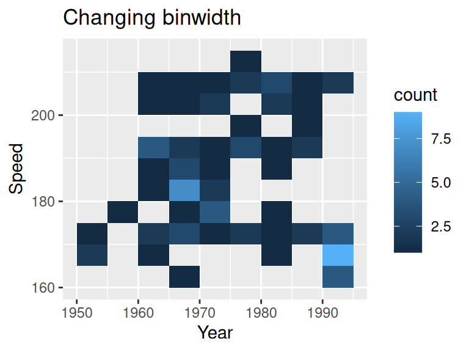

# Two continuous variables

In this chapter, we will look at techniques that explore the relationships between two continuous variables.

## Scatterplot

### Basics and implications

For the following example, we use data set `SpeedSki`. 


```r
library(GDAdata)
library(ggplot2)

ggplot(SpeedSki, aes(Year, Speed)) + 
  geom_point() +
  labs(x = "Birth year", y = "Speed achieved (km/hr)") +
  ggtitle("Skiers by birth year and speed achieved")
```


In our example, we simply use `geom_point` on variables `Year` and `Speed` to create the scatterplot. we try to capture if there is a relationship between the age of a player and the speed he/she can achieve. From the graph, it seems such relationship does not exist. Overall, scatterplots are very useful in understanding the correlation (or lack thereof) between variables. The scatterplot gives a good idea of whether that relationship is positive or negative and if there’s a correlation. However, don’t mistake correlation in a scatterplot for causation!

### Overplotting

In some situations a scatter plot faces the problem of overplotting as there are so many points overlapping. Consider the following example from class. To save time, we randomly sample 20% of the data in advance.


```r
library(dplyr)
library(ggplot2movies)

sample <- slice_sample(movies, prop = 0.2)

ggplot(sample,aes(x=votes,y=rating)) +
  geom_point() +
  ggtitle("Votes vs. rating") +
  theme_classic()
```


To create better visuals, we can use:

* Alpha blending - `alpha=...`

* Open circles - `pch=21`

* smaller circles - `size=...` or `shape="."`


```r
library(gridExtra)

f1 <- ggplot(sample,aes(x=votes,y=rating)) +
  geom_point(alpha=0.3) +
  theme_classic() +
  ggtitle("Alpha blending")

f2 <- ggplot(sample,aes(x=votes,y=rating)) +
  geom_point(pch = 21) +
  theme_classic() +
  ggtitle("Open circle")

f3 <- ggplot(sample,aes(x=votes,y=rating)) +
  geom_point(size=0.5) +
  theme_classic() +
  ggtitle("Smaller circle")

grid.arrange(f1, f2, f3,nrow = 3)
```


Other methods that directly deal with the data:

* Randomly sample data - as shown in the first code chunk using `sample_n`

* Subset - split data into bins using `ntile(votes, 10)`

* Remove outliers 

* Transform to log scale

### Interactive scatterplot

You can create an interactive scatterplot using `plotly`. In the following example, we take 1% of the movie data set to present a better visual. We plotted the votes vs. rating and grouped by the year they are released. In this graph:

* You can hover on to the points to see the title of the movie

* You can double click on the year legend to look at a certain year

* You can zoom into a certain part of the graph to better understand the data points.


```r
library(plotly)

sample2 <- slice_sample(movies,prop=0.01) %>%
  filter(year > 2000)

plot_ly(sample2, x = ~votes, y = ~rating,
        color = ~as.factor(year), text= ~title,
        hoverinfo = 'text') 
```

```{=html}
<div class="plotly html-widget html-fill-item-overflow-hidden html-fill-item" id="htmlwidget-311d49959adb51877649" style="width:576px;height:432px;"></div>
<script type="application/json" data-for="htmlwidget-311d49959adb51877649">{"x":{"visdat":{"2daf1537b8a9":["function () ","plotlyVisDat"]},"cur_data":"2daf1537b8a9","attrs":{"2daf1537b8a9":{"x":{},"y":{},"text":{},"hoverinfo":"text","color":{},"alpha_stroke":1,"sizes":[10,100],"spans":[1,20]}},"layout":{"margin":{"b":40,"l":60,"t":25,"r":10},"xaxis":{"domain":[0,1],"automargin":true,"title":"votes"},"yaxis":{"domain":[0,1],"automargin":true,"title":"rating"},"hovermode":"closest","showlegend":true},"source":"A","config":{"modeBarButtonsToAdd":["hoverclosest","hovercompare"],"showSendToCloud":false},"data":[{"x":[16,1933,16,131,502,7,11,10795,24,21,15,18,13,434,5,38,46,53,12382],"y":[4,7.7,6.7,7.7,6.7,5.6,6.7,6.6,3.4,4.7,7.1,5.8,6.9,6.1,5.9,7.5,8.4,7.3,6.7],"text":["Ukjent, En","Hijo de la novia, El","Come and Take it Day","Kurosawa","Zus & zo","Max and Zoe","Tuesday","Serendipity","Qingse ditu","Asylum Days","Dead Dogs Lie","Kattbreven","Cold Fish","Bartleby","Man with the Empty Room, The","Taxi, un encuentro","Come Together","Yazgi","Bandits"],"hoverinfo":["text","text","text","text","text","text","text","text","text","text","text","text","text","text","text","text","text","text","text"],"type":"scatter","mode":"markers","name":"2001","marker":{"color":"rgba(102,194,165,1)","line":{"color":"rgba(102,194,165,1)"}},"textfont":{"color":"rgba(102,194,165,1)"},"error_y":{"color":"rgba(102,194,165,1)"},"error_x":{"color":"rgba(102,194,165,1)"},"line":{"color":"rgba(102,194,165,1)"},"xaxis":"x","yaxis":"y","frame":null},{"x":[312,74,988,10,7,7,632,16,55,5,23,426,8,15,35,51,130,16,7,165,16692,68,17,88,21,15,225,5,34,15,4472],"y":[7.8,5.6,5.8,8.1,9.1,6,7.1,6.6,4,9,1.9,7.1,6.2,3.9,3.5,5.3,7.5,5.3,9.1,7.2,7.6,6.1,7.7,5,7.2,5.1,4.8,7.7,6.8,7.5,7.4],"text":["Backyard, The","24 heures de la vie d'une femme","Return to Never Land","Out of These Rooms","Myster General, The","Return of the Monster","Unconditional Love","Lemon Crush","Chopin. Pragnienie milosci","Outcasts","Essence of Echoes","Monsieur Batignole","25 Kids and a Dad","Rutland, USA","Lobo Paramilitary Christmas Special, The","19 Months","Kannathil Muthamittal","Karamuk","Stay Clean","Yeonae sosheol","Hours, The","Mizu no onna","Fueling the Fire","Malevolent","Tokyo.Sora","Hard Fat","Dead in the Water","Frank Zappa: Phase II - The Big Note","Cuento de hadas para dormir cocodrilos","Cravan vs. Cravan","Antwone Fisher"],"hoverinfo":["text","text","text","text","text","text","text","text","text","text","text","text","text","text","text","text","text","text","text","text","text","text","text","text","text","text","text","text","text","text","text"],"type":"scatter","mode":"markers","name":"2002","marker":{"color":"rgba(252,141,98,1)","line":{"color":"rgba(252,141,98,1)"}},"textfont":{"color":"rgba(252,141,98,1)"},"error_y":{"color":"rgba(252,141,98,1)"},"error_x":{"color":"rgba(252,141,98,1)"},"line":{"color":"rgba(252,141,98,1)"},"xaxis":"x","yaxis":"y","frame":null},{"x":[28,6,10524,22,10,77,34,243,6,801,69,5,8,1184,11189,120,20,148,3678,1537,10,60,22],"y":[6.6,7.3,5.8,1.9,7.1,5.5,7.7,6.5,8.3,5.5,6.2,6.4,5.9,5.3,7.2,6.4,6.3,6.3,6.5,5.5,6.5,4.9,8.1],"text":["Tom Hits His Head","Expreso nocturno","Gothika","Xuxa Abracadabra","Druckbolzen","Cid: La leyenda, El","Babiy Yar","Hija del canibal, La","Nitschewo","Blind Horizon","Haz conmigo lo que quieras","Bob 3:13","Jemima: Dating Is Murder","Singing Detective, The","Bad Santa","Hatley High","Taqueria, La","7 ans de mariage","Anything Else","How to Deal","Cible, La","Woman Hunted, A","Ferry Tales"],"hoverinfo":["text","text","text","text","text","text","text","text","text","text","text","text","text","text","text","text","text","text","text","text","text","text","text"],"type":"scatter","mode":"markers","name":"2003","marker":{"color":"rgba(141,160,203,1)","line":{"color":"rgba(141,160,203,1)"}},"textfont":{"color":"rgba(141,160,203,1)"},"error_y":{"color":"rgba(141,160,203,1)"},"error_x":{"color":"rgba(141,160,203,1)"},"line":{"color":"rgba(141,160,203,1)"},"xaxis":"x","yaxis":"y","frame":null},{"x":[1164,8,124,110,45,6,51,490,56,18,289,16,81,139,10,205,4050,23,34,18,19],"y":[6.5,7.4,5.3,6.6,1.7,9,9.8,6.2,3.7,8.1,6.5,6.6,8.1,5,5,6.7,3.2,7,6.8,7.6,7.5],"text":["Football Factory, The","Dark Legacy","Agent Orange","In Oranje","Death 4 Told","Late Bloomer","Cashback","Bobby Jones, Stroke of Genius","Fuck Norge","For Always","Notre musique","Point&Shoot","Memoria del saqueo","Chump Change","Diez minutos","Lobo, El","Torque","Mitte, Die","Ballet gyoseubso","17th Man, The","Last Full Measure, The"],"hoverinfo":["text","text","text","text","text","text","text","text","text","text","text","text","text","text","text","text","text","text","text","text","text"],"type":"scatter","mode":"markers","name":"2004","marker":{"color":"rgba(231,138,195,1)","line":{"color":"rgba(231,138,195,1)"}},"textfont":{"color":"rgba(231,138,195,1)"},"error_y":{"color":"rgba(231,138,195,1)"},"error_x":{"color":"rgba(231,138,195,1)"},"line":{"color":"rgba(231,138,195,1)"},"xaxis":"x","yaxis":"y","frame":null},{"x":[12,62,230,247],"y":[7.9,6,4.9,6.9],"text":["Sith Apprentice","My Big Fat Independent Movie","Dear Wendy","Turetskii gambit"],"hoverinfo":["text","text","text","text"],"type":"scatter","mode":"markers","name":"2005","marker":{"color":"rgba(166,216,84,1)","line":{"color":"rgba(166,216,84,1)"}},"textfont":{"color":"rgba(166,216,84,1)"},"error_y":{"color":"rgba(166,216,84,1)"},"error_x":{"color":"rgba(166,216,84,1)"},"line":{"color":"rgba(166,216,84,1)"},"xaxis":"x","yaxis":"y","frame":null}],"highlight":{"on":"plotly_click","persistent":false,"dynamic":false,"selectize":false,"opacityDim":0.2,"selected":{"opacity":1},"debounce":0},"shinyEvents":["plotly_hover","plotly_click","plotly_selected","plotly_relayout","plotly_brushed","plotly_brushing","plotly_clickannotation","plotly_doubleclick","plotly_deselect","plotly_afterplot","plotly_sunburstclick"],"base_url":"https://plot.ly"},"evals":[],"jsHooks":[]}</script>
```

### Modifications

#### Contour lines

Contour lines give a sense of the density of the data at a glance.

For these contour maps, we will use the `SpeedSki` dataset.

Contour lines can be added to the plot using geom_density_2d() and contour lines work best when combined with other layers


```r
ggplot(SpeedSki, aes(Year, Speed)) + 
  geom_density_2d(bins=5) +
  geom_point() +
  ggtitle("Scatter plot with contour line")
```


You can use `bins` to control the number of contour bins.

#### Scatterplot matrices

If you want to compare multiple parameters to each other, consider using a scatterplot matrix. This will allow you to show many comparisons in a compact and efficient manner.

For these scatterplot matrices, we use the `movies` dataset from the `ggplot2movies` package.

As a default, the base R plot() function will create a scatterplot matrix when given multiple variables:


```r
sample3 <- slice_sample(movies,prop=0.01) #sample data

splomvar <- sample3 %>% 
  dplyr::select(length, budget, votes, rating, year)

plot(splomvar)
```


While this is quite useful for personal exploration of a dataset, it is **not** recommended for presentation purposes. Something called the [Hermann grid illusion](https://en.wikipedia.org/wiki/Grid_illusion){target="_blank"} makes this plot very difficult to examine.


## Heatmaps

### Basics and implications 

In the following example, we still use the `SpeedSki` data set.


```r
ggplot(SpeedSki, aes(Year, Speed)) + 
  geom_bin2d() 
```


To create a heatmap, simply substitute `geom_point()` with `geom_bin2d()`. Generally, heat maps are like a combination of scatterplots and histograms: they allow you to compare different parameters while also seeing their relative distributions.

### Modifications

For the following section, we introduce some variations on heatmaps.

#### Change number of bins / binwidth

By default, `geom_bin2d()` use 30 bins. Similar to a histogram, we can change the number of bins or binwidth.


```r
ggplot(SpeedSki, aes(Year, Speed)) + 
  geom_bin2d(binwidth = c(5,5)) +
  ggtitle("Changing binwidth")
```



Notice we are specifying the binwidth for both x and y axis.

#### Combine with a scatterplot


```r
ggplot(SpeedSki, aes(Year, Speed)) +
  geom_bin2d(binwidth = c(10, 10), alpha = .4) + 
  geom_point(size = 2) +
  ggtitle("Combined with scatterplot")
```


#### Change color scale

You can change the continuous scale of color 


```r
ggplot(SpeedSki, aes(Year, Speed)) + 
  geom_bin2d() +
  ggtitle("Changing color scale") + 
  scale_fill_viridis_c()
```


#### Hex heatmap

One alternative is a hex heatmap. You can create the graph using `geom_hex`


```r
ggplot(SpeedSki, aes(Year, Speed)) + 
  geom_hex(binswidth = c(10,10)) +
  ggtitle("Hex heatmap")
```


#### Alternative approach to color

If you look at all the previous examples, you might notice that lighter points correspond to more clustered points, which is somewhat counter-intuitive. The following example suggests an alternative approach in color scale.


```r
ggplot(SpeedSki, aes(Year, Speed)) + 
  geom_hex(bins=12) +
  scale_fill_gradient(low = "grey", high = "purple") +  
  theme_classic(18) +
  ggtitle("Alternative approach to color")
```


