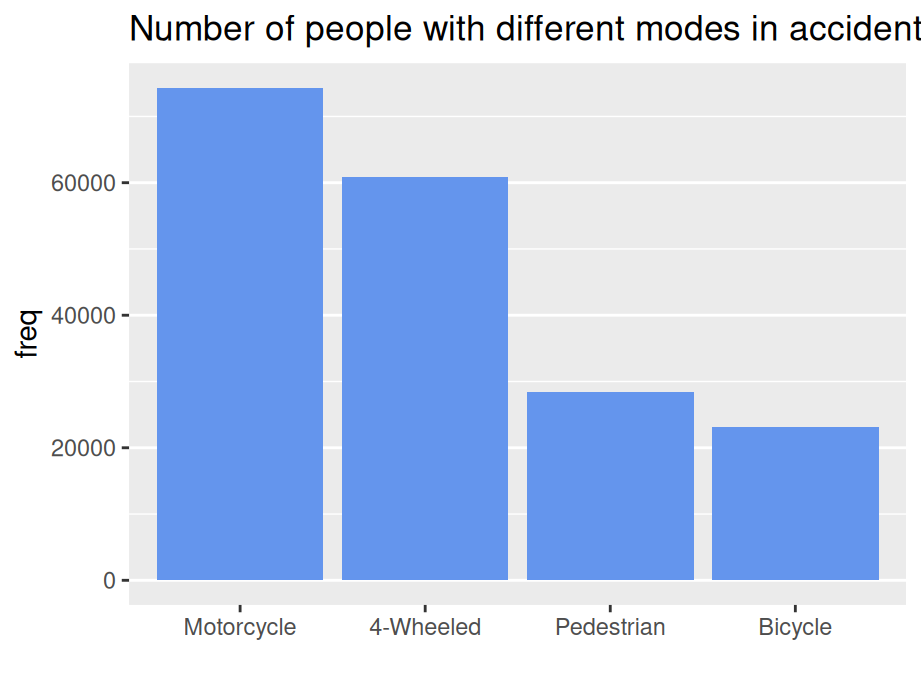

# Unidimensional categorical variables

In real-world datasets, categorical features are quite common but tricky during both the data pre-processing and visualization process. In this chapter, we will demonstrate several plotting options for the uni-dimensional categorical variables with ``ggplot``.

## Bar plot

There are two types of uni-dimensional categorical variables: nominal and ordinal. Here you will be shown how these variables should be plotted differently using bar plot under the same dataset.

### Nominal data

Nominal data is data with no fixed category order and should be sorted from highest to lowest count (left to right, or top to bottom)


```r
library(vcdExtra)
library(ggplot2)
library(forcats)
library(dplyr)

Accident %>%
  group_by(mode) %>%
  summarise(freq = sum(Freq)) %>%
  ggplot(aes(x=fct_reorder(mode,freq,.desc = TRUE),y=freq)) +
  geom_bar(stat = "identity") +
  ggtitle("Number of people with different modes in accident") +
  xlab("") +
  theme_bw(16) +
  theme(panel.grid.major.x = element_blank())
```



… or top to bottom


```r
Accident %>%
  group_by(mode) %>%
  summarise(freq = sum(Freq)) %>%
  ggplot(aes(x=fct_rev(fct_reorder(mode,freq,.desc = TRUE)),y=freq)) +
  geom_bar(stat = "identity",fill = "cornflowerblue") +
  ggtitle("Number of people with different modes in accident") +
  coord_flip() +
  xlab("") +
  theme_bw(16) +
  theme(panel.grid.major.x = element_blank())
```


### Ordinal data

Ordinal data is data having a fixed category order and need to sort it in logical order of the categories (left to right)


```r
Accident %>%
  group_by(age) %>%
  summarise(freq = sum(Freq)) %>%
  ggplot(aes(x=age,y=freq)) +
  geom_bar(stat = "identity",fill = "cornflowerblue") +
  ggtitle("Number of people of different ages in accident") +
  xlab("") +
  theme_bw(16) +
  theme(panel.grid.major.x = element_blank())
```


Sort in logical order of the categories (starting at bottom OR top)


```r
Accident %>%
  group_by(age) %>%
  summarise(freq = sum(Freq)) %>%
  ggplot(aes(x=age,y=freq)) +
  geom_bar(stat = "identity",fill = "cornflowerblue") +
  ggtitle("Number of people of different ages in accident") +
  xlab("") +
  coord_flip() +
  theme_bw(16) +
  theme(panel.grid.major.x = element_blank())
```


